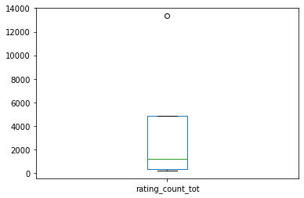
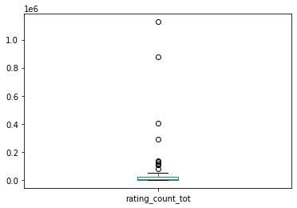

<h1 align='center'>Mobile Apps: Partial Environmental Analysis</h1>

<h2>Contents</h2>
<ol>
    <li><a href='#results'>Summary of Results</a></li>
    <li><a href='#source'>Data Source and Discussion</a></li>
    <li><a href='#pre'>Data Preprocessing</a></li>
    <li><a href='#common'>Most Common Apps by Genre</a></li>
    <li><a href='#popApp'>Most Popular Apps by Genre: App Store </a></li>
    <li><a href='#popGoogle'>Most Popular Apps by Genre: Google Play </a></li>
    
</ol>


<a id='results'></a><h2>Summary of Results</h2>

From the perspective of gaps in market offerings that a new development company could leverage to launch a successful initial product, we aim in this project to understand trends in popular mobile apps.  We will focus on behavior in the Google Play store and Apple iOS App store, and we will limit our attention to apps that are free to download and install.  Broadly speaking, we will not account for political, economic, social, or legal factors, hence only performing part of the environmental analysis that such a company should complete.

We will build our work on the assumption that visibility in the respective app stores is essential to success.  And, moreover, that visibility is a byproduct of algorithms that favor already popular apps.  We will utilize included data on app genre and categorization so that our hypthetical development company may focus on some subset of the app store that is popular with users but also possesses potential for small companies to get their footing.  For example, we will find that some categories are entirely dominated by large corporations, against which a small company would never be able to outspend nor outcompute.

Ultimately, we will identify three areas in the Apple store (reference, health and beauty, and catalogs) and five areas in the Google store (health and fitness, house and home, art and design, personalization, and tools) in which a novel idea has the room to rise to a prominent position in the "leaderboards."  The reasoning for including these and exluding other popular categories is included in the course of our discussion.

note: I acknowledge that my hypothetical premise of a new company looking to chase a trend to build an app is almost certainly not a very good recipe for the longevity of the company.  If you prefer, please replace this framework for one where an established company is trying to understand the structure of the marketplace and why their existing app is not being recommended often enough.

<a id='source'></a><h2>Data Source and Discussion</h2>

The data come from two sources: data on the <a href='https://www.kaggle.com/lava18/google-play-store-apps' target='_blank'>Google Play Store</a> includes 10841 observations and data on the <a href='https://www.kaggle.com/ramamet4/app-store-apple-data-set-10k-apps' target='_blank'>Apple iOS App Store</a> includes 7197 observations.

Each data set possesses its own schema, as can be seen by the given columns:


```python
#setup our standard environment and a dataframe of the dataset
import pandas as pd
import numpy as np
```


```python
google_raw = pd.read_csv('googleplaystore.csv')
apple_raw = pd.read_csv('AppleStore.csv')
```


```python
google_raw.columns
```


    Index(['App', 'Category', 'Rating', 'Reviews', 'Size', 'Installs', 'Type',
           'Price', 'Content Rating', 'Genres', 'Last Updated', 'Current Ver',
           'Android Ver'],
          dtype='object')


```python
apple_raw.columns
```


    Index(['id', 'track_name', 'size_bytes', 'currency', 'price',
           'rating_count_tot', 'rating_count_ver', 'user_rating',
           'user_rating_ver', 'ver', 'cont_rating', 'prime_genre',
           'sup_devices.num', 'ipadSc_urls.num', 'lang.num', 'vpp_lic'],
          dtype='object')


As such, our first task is to clean any problem points and designate those columns that will be useful for our present purposes.

<a id='pre'></a><h2>Data Preprocessing</h2>

First, if we inspect the App variable of the Google dataset, we find that there are numerous duplicate apps.  More precisely, the number of duplicate apps is:


```python
len(google_raw['App'])-len(google_raw['App'].unique())
```


    1181


If we inspect some of these duplicates:


```python
google_raw[google_raw.duplicated(subset=['App'])]
```


<div>
<style scoped>
    .dataframe tbody tr th:only-of-type {
        vertical-align: middle;
    }

    .dataframe tbody tr th {
        vertical-align: top;
    }

    .dataframe thead th {
        text-align: right;
    }
</style>
<table border="1" class="dataframe">
  <thead>
    <tr style="text-align: right;">
      <th></th>
      <th>App</th>
      <th>Category</th>
      <th>Rating</th>
      <th>Reviews</th>
      <th>Size</th>
      <th>Installs</th>
      <th>Type</th>
      <th>Price</th>
      <th>Content Rating</th>
      <th>Genres</th>
      <th>Last Updated</th>
      <th>Current Ver</th>
      <th>Android Ver</th>
    </tr>
  </thead>
  <tbody>
    <tr>
      <th>229</th>
      <td>Quick PDF Scanner + OCR FREE</td>
      <td>BUSINESS</td>
      <td>4.2</td>
      <td>80805</td>
      <td>Varies with device</td>
      <td>5,000,000+</td>
      <td>Free</td>
      <td>0</td>
      <td>Everyone</td>
      <td>Business</td>
      <td>February 26, 2018</td>
      <td>Varies with device</td>
      <td>4.0.3 and up</td>
    </tr>
    <tr>
      <th>236</th>
      <td>Box</td>
      <td>BUSINESS</td>
      <td>4.2</td>
      <td>159872</td>
      <td>Varies with device</td>
      <td>10,000,000+</td>
      <td>Free</td>
      <td>0</td>
      <td>Everyone</td>
      <td>Business</td>
      <td>July 31, 2018</td>
      <td>Varies with device</td>
      <td>Varies with device</td>
    </tr>
    <tr>
      <th>239</th>
      <td>Google My Business</td>
      <td>BUSINESS</td>
      <td>4.4</td>
      <td>70991</td>
      <td>Varies with device</td>
      <td>5,000,000+</td>
      <td>Free</td>
      <td>0</td>
      <td>Everyone</td>
      <td>Business</td>
      <td>July 24, 2018</td>
      <td>2.19.0.204537701</td>
      <td>4.4 and up</td>
    </tr>
    <tr>
      <th>256</th>
      <td>ZOOM Cloud Meetings</td>
      <td>BUSINESS</td>
      <td>4.4</td>
      <td>31614</td>
      <td>37M</td>
      <td>10,000,000+</td>
      <td>Free</td>
      <td>0</td>
      <td>Everyone</td>
      <td>Business</td>
      <td>July 20, 2018</td>
      <td>4.1.28165.0716</td>
      <td>4.0 and up</td>
    </tr>
    <tr>
      <th>261</th>
      <td>join.me - Simple Meetings</td>
      <td>BUSINESS</td>
      <td>4.0</td>
      <td>6989</td>
      <td>Varies with device</td>
      <td>1,000,000+</td>
      <td>Free</td>
      <td>0</td>
      <td>Everyone</td>
      <td>Business</td>
      <td>July 16, 2018</td>
      <td>4.3.0.508</td>
      <td>4.4 and up</td>
    </tr>
    <tr>
      <th>...</th>
      <td>...</td>
      <td>...</td>
      <td>...</td>
      <td>...</td>
      <td>...</td>
      <td>...</td>
      <td>...</td>
      <td>...</td>
      <td>...</td>
      <td>...</td>
      <td>...</td>
      <td>...</td>
      <td>...</td>
    </tr>
    <tr>
      <th>10715</th>
      <td>FarmersOnly Dating</td>
      <td>DATING</td>
      <td>3.0</td>
      <td>1145</td>
      <td>1.4M</td>
      <td>100,000+</td>
      <td>Free</td>
      <td>0</td>
      <td>Mature 17+</td>
      <td>Dating</td>
      <td>February 25, 2016</td>
      <td>2.2</td>
      <td>4.0 and up</td>
    </tr>
    <tr>
      <th>10720</th>
      <td>Firefox Focus: The privacy browser</td>
      <td>COMMUNICATION</td>
      <td>4.4</td>
      <td>36981</td>
      <td>4.0M</td>
      <td>1,000,000+</td>
      <td>Free</td>
      <td>0</td>
      <td>Everyone</td>
      <td>Communication</td>
      <td>July 6, 2018</td>
      <td>5.2</td>
      <td>5.0 and up</td>
    </tr>
    <tr>
      <th>10730</th>
      <td>FP Notebook</td>
      <td>MEDICAL</td>
      <td>4.5</td>
      <td>410</td>
      <td>60M</td>
      <td>50,000+</td>
      <td>Free</td>
      <td>0</td>
      <td>Everyone</td>
      <td>Medical</td>
      <td>March 24, 2018</td>
      <td>2.1.0.372</td>
      <td>4.4 and up</td>
    </tr>
    <tr>
      <th>10753</th>
      <td>Slickdeals: Coupons &amp; Shopping</td>
      <td>SHOPPING</td>
      <td>4.5</td>
      <td>33599</td>
      <td>12M</td>
      <td>1,000,000+</td>
      <td>Free</td>
      <td>0</td>
      <td>Everyone</td>
      <td>Shopping</td>
      <td>July 30, 2018</td>
      <td>3.9</td>
      <td>4.4 and up</td>
    </tr>
    <tr>
      <th>10768</th>
      <td>AAFP</td>
      <td>MEDICAL</td>
      <td>3.8</td>
      <td>63</td>
      <td>24M</td>
      <td>10,000+</td>
      <td>Free</td>
      <td>0</td>
      <td>Everyone</td>
      <td>Medical</td>
      <td>June 22, 2018</td>
      <td>2.3.1</td>
      <td>5.0 and up</td>
    </tr>
  </tbody>
</table>
<p>1181 rows × 13 columns</p>
</div>


```python
google_raw[google_raw['App'] == '8 Ball Pool']
```


<div>
<style scoped>
    .dataframe tbody tr th:only-of-type {
        vertical-align: middle;
    }

    .dataframe tbody tr th {
        vertical-align: top;
    }

    .dataframe thead th {
        text-align: right;
    }
</style>
<table border="1" class="dataframe">
  <thead>
    <tr style="text-align: right;">
      <th></th>
      <th>App</th>
      <th>Category</th>
      <th>Rating</th>
      <th>Reviews</th>
      <th>Size</th>
      <th>Installs</th>
      <th>Type</th>
      <th>Price</th>
      <th>Content Rating</th>
      <th>Genres</th>
      <th>Last Updated</th>
      <th>Current Ver</th>
      <th>Android Ver</th>
    </tr>
  </thead>
  <tbody>
    <tr>
      <th>1675</th>
      <td>8 Ball Pool</td>
      <td>GAME</td>
      <td>4.5</td>
      <td>14198297</td>
      <td>52M</td>
      <td>100,000,000+</td>
      <td>Free</td>
      <td>0</td>
      <td>Everyone</td>
      <td>Sports</td>
      <td>July 31, 2018</td>
      <td>4.0.0</td>
      <td>4.0.3 and up</td>
    </tr>
    <tr>
      <th>1703</th>
      <td>8 Ball Pool</td>
      <td>GAME</td>
      <td>4.5</td>
      <td>14198602</td>
      <td>52M</td>
      <td>100,000,000+</td>
      <td>Free</td>
      <td>0</td>
      <td>Everyone</td>
      <td>Sports</td>
      <td>July 31, 2018</td>
      <td>4.0.0</td>
      <td>4.0.3 and up</td>
    </tr>
    <tr>
      <th>1755</th>
      <td>8 Ball Pool</td>
      <td>GAME</td>
      <td>4.5</td>
      <td>14200344</td>
      <td>52M</td>
      <td>100,000,000+</td>
      <td>Free</td>
      <td>0</td>
      <td>Everyone</td>
      <td>Sports</td>
      <td>July 31, 2018</td>
      <td>4.0.0</td>
      <td>4.0.3 and up</td>
    </tr>
    <tr>
      <th>1844</th>
      <td>8 Ball Pool</td>
      <td>GAME</td>
      <td>4.5</td>
      <td>14200550</td>
      <td>52M</td>
      <td>100,000,000+</td>
      <td>Free</td>
      <td>0</td>
      <td>Everyone</td>
      <td>Sports</td>
      <td>July 31, 2018</td>
      <td>4.0.0</td>
      <td>4.0.3 and up</td>
    </tr>
    <tr>
      <th>1871</th>
      <td>8 Ball Pool</td>
      <td>GAME</td>
      <td>4.5</td>
      <td>14201891</td>
      <td>52M</td>
      <td>100,000,000+</td>
      <td>Free</td>
      <td>0</td>
      <td>Everyone</td>
      <td>Sports</td>
      <td>July 31, 2018</td>
      <td>4.0.0</td>
      <td>4.0.3 and up</td>
    </tr>
    <tr>
      <th>1970</th>
      <td>8 Ball Pool</td>
      <td>GAME</td>
      <td>4.5</td>
      <td>14201604</td>
      <td>52M</td>
      <td>100,000,000+</td>
      <td>Free</td>
      <td>0</td>
      <td>Everyone</td>
      <td>Sports</td>
      <td>July 31, 2018</td>
      <td>4.0.0</td>
      <td>4.0.3 and up</td>
    </tr>
    <tr>
      <th>3953</th>
      <td>8 Ball Pool</td>
      <td>SPORTS</td>
      <td>4.5</td>
      <td>14184910</td>
      <td>52M</td>
      <td>100,000,000+</td>
      <td>Free</td>
      <td>0</td>
      <td>Everyone</td>
      <td>Sports</td>
      <td>July 31, 2018</td>
      <td>4.0.0</td>
      <td>4.0.3 and up</td>
    </tr>
  </tbody>
</table>
</div>


```python
google_raw[google_raw['App'] == 'Instagram']
```


<div>
<style scoped>
    .dataframe tbody tr th:only-of-type {
        vertical-align: middle;
    }

    .dataframe tbody tr th {
        vertical-align: top;
    }

    .dataframe thead th {
        text-align: right;
    }
</style>
<table border="1" class="dataframe">
  <thead>
    <tr style="text-align: right;">
      <th></th>
      <th>App</th>
      <th>Category</th>
      <th>Rating</th>
      <th>Reviews</th>
      <th>Size</th>
      <th>Installs</th>
      <th>Type</th>
      <th>Price</th>
      <th>Content Rating</th>
      <th>Genres</th>
      <th>Last Updated</th>
      <th>Current Ver</th>
      <th>Android Ver</th>
    </tr>
  </thead>
  <tbody>
    <tr>
      <th>2545</th>
      <td>Instagram</td>
      <td>SOCIAL</td>
      <td>4.5</td>
      <td>66577313</td>
      <td>Varies with device</td>
      <td>1,000,000,000+</td>
      <td>Free</td>
      <td>0</td>
      <td>Teen</td>
      <td>Social</td>
      <td>July 31, 2018</td>
      <td>Varies with device</td>
      <td>Varies with device</td>
    </tr>
    <tr>
      <th>2604</th>
      <td>Instagram</td>
      <td>SOCIAL</td>
      <td>4.5</td>
      <td>66577446</td>
      <td>Varies with device</td>
      <td>1,000,000,000+</td>
      <td>Free</td>
      <td>0</td>
      <td>Teen</td>
      <td>Social</td>
      <td>July 31, 2018</td>
      <td>Varies with device</td>
      <td>Varies with device</td>
    </tr>
    <tr>
      <th>2611</th>
      <td>Instagram</td>
      <td>SOCIAL</td>
      <td>4.5</td>
      <td>66577313</td>
      <td>Varies with device</td>
      <td>1,000,000,000+</td>
      <td>Free</td>
      <td>0</td>
      <td>Teen</td>
      <td>Social</td>
      <td>July 31, 2018</td>
      <td>Varies with device</td>
      <td>Varies with device</td>
    </tr>
    <tr>
      <th>3909</th>
      <td>Instagram</td>
      <td>SOCIAL</td>
      <td>4.5</td>
      <td>66509917</td>
      <td>Varies with device</td>
      <td>1,000,000,000+</td>
      <td>Free</td>
      <td>0</td>
      <td>Teen</td>
      <td>Social</td>
      <td>July 31, 2018</td>
      <td>Varies with device</td>
      <td>Varies with device</td>
    </tr>
  </tbody>
</table>
</div>


We find that it is predominantly the number of reviews and just simple duplicate entry that accounts for the duplication.  As such, we will remove the duplicate observations through the built-in function: 


```python
google_raw = google_raw.drop_duplicates(subset=['App'])
```


```python
#quick sanity check
len(google_raw['App'])-len(google_raw['App'].unique())
```


    0


Next, we will limit our attention to apps in English.  We will do so through a function that inspects the frequency of non-ASCII characters and then apply this to our App variable. Note: ultimately, this will remove 30 apps.


```python
def isAscii(string):
    non_ascii = 0
    
    for character in string:
        if ord(character) > 127:
            non_ascii += 1
    
    if non_ascii > 3:
        return False
    else:
        return True
```


```python
google_raw = google_raw[google_raw['App'].apply(isAscii)]
```

Our final piece of clean-up for the Google data is to filter out the paid apps, of which there are 753.


```python
google_clean = google_raw[google_raw['Type']== 'Free']
```

We complete these same steps for the Apple data, without additional comment.


```python
len(apple_raw['track_name'])-len(apple_raw['track_name'].unique())
```


    2


```python
apple_raw = apple_raw.drop_duplicates(subset=['track_name'])
```


```python
apple_raw = apple_raw[apple_raw['track_name'].apply(isAscii)]
```


```python
apple_clean = apple_raw[apple_raw['price']== 0]
```

<a id='common'></a><h2>Most Common Apps by Genre</h2>

We are interested in identifying the most successful apps on both markets.  With our data now in a clean and usable format, we start this analysis by identifying the most common genres for each market.  We accomplish this by looking at the frequency occurence of each genre.


```python
#first we can inspect the counts
apple_clean['prime_genre'].value_counts()
```


    Games                1872
    Entertainment         254
    Photo & Video         160
    Education             118
    Social Networking     106
    Shopping               84
    Utilities              81
    Sports                 69
    Music                  66
    Health & Fitness       65
    Productivity           56
    Lifestyle              51
    News                   43
    Travel                 40
    Finance                36
    Weather                28
    Food & Drink           26
    Reference              18
    Business               17
    Book                   14
    Medical                 6
    Navigation              6
    Catalogs                4
    Name: prime_genre, dtype: int64


```python
#a simple adjustment returns these as percentages of the total
apple_clean['prime_genre'].value_counts(normalize=True)
```


    Games                0.581366
    Entertainment        0.078882
    Photo & Video        0.049689
    Education            0.036646
    Social Networking    0.032919
    Shopping             0.026087
    Utilities            0.025155
    Sports               0.021429
    Music                0.020497
    Health & Fitness     0.020186
    Productivity         0.017391
    Lifestyle            0.015839
    News                 0.013354
    Travel               0.012422
    Finance              0.011180
    Weather              0.008696
    Food & Drink         0.008075
    Reference            0.005590
    Business             0.005280
    Book                 0.004348
    Medical              0.001863
    Navigation           0.001863
    Catalogs             0.001242
    Name: prime_genre, dtype: float64


Our results indicate that, amongst free English-langauge apps on the App store, games consititute more than half of the total.  More generally, apps oriented towards amusement (e.g., games, entertainment, social networking, sports) comprise about 80% of the market, while apps with practical utility (e.g., education, shopping, utilities, productivity, lifestyle) comprise the remaining 20%.  However, more work will be needed below as these counts do not indicate the number of users.

For the Google Play store, we find:


```python
google_clean['Category'].value_counts(normalize=True)
```


    FAMILY                 0.184404
    GAME                   0.098747
    TOOLS                  0.084415
    BUSINESS               0.045932
    LIFESTYLE              0.039048
    PRODUCTIVITY           0.038935
    FINANCE                0.037016
    MEDICAL                0.035210
    SPORTS                 0.033969
    PERSONALIZATION        0.033179
    COMMUNICATION          0.032389
    HEALTH_AND_FITNESS     0.030809
    PHOTOGRAPHY            0.029455
    NEWS_AND_MAGAZINES     0.027988
    SOCIAL                 0.026634
    TRAVEL_AND_LOCAL       0.023361
    SHOPPING               0.022458
    BOOKS_AND_REFERENCE    0.021442
    DATING                 0.018621
    VIDEO_PLAYERS          0.017831
    MAPS_AND_NAVIGATION    0.013994
    EDUCATION              0.012865
    FOOD_AND_DRINK         0.012414
    ENTERTAINMENT          0.011285
    LIBRARIES_AND_DEMO     0.009367
    AUTO_AND_VEHICLES      0.009254
    HOUSE_AND_HOME         0.008351
    WEATHER                0.008013
    EVENTS                 0.007110
    ART_AND_DESIGN         0.006771
    PARENTING              0.006546
    COMICS                 0.006207
    BEAUTY                 0.005981
    Name: Category, dtype: float64


indicating a drastically different marketplace.  There is a significantly greater emphasis on labelling apps intended for children (i.e., family).  Games are significantly less represented.  Amusement apps, more generally, occupy either about 22% or 40%, depending on whether we include the family category.  And, practical utility apps occupy about 60% of the market.

Overall, because the markets utilize different schemas and the number of apps does not indicate the number of users, we need to extend this analysis.

<a id='popApp'></a><h2>Most Popular Apps by Genre: App Store</h2>

One measure of popularity would be the average number of installs for each app genre.  Unfortunately, this information is not available in the Apple data, but we can use the number of user ratings as a proxy.  Doing so does have a number of hidden variables (e.g.,user enthusiasm, user happiness, user expectations, genre variation), so our results should be taken with some hesitation.


```python
#group by genre, limit results to rating count, generate median
apple_clean.groupby(by="prime_genre")['rating_count_tot'].median().sort_values(ascending=False)
```


    prime_genre
    Productivity         8737.5
    Navigation           8196.5
    Reference            6614.0
    Shopping             5936.0
    Social Networking    4199.0
    Music                3850.0
    Health & Fitness     2459.0
    Photo & Video        2206.0
    Finance              1931.0
    Sports               1628.0
    Food & Drink         1490.5
    Catalogs             1229.0
    Entertainment        1197.5
    Business             1150.0
    Lifestyle            1111.0
    Utilities            1110.0
    Games                 904.0
    Travel                798.5
    Education             606.5
    Medical               566.5
    Book                  421.5
    News                  373.0
    Weather               289.0
    Name: rating_count_tot, dtype: float64


```python
apple_clean.groupby(by="prime_genre")['rating_count_tot'].describe()
```


<div>
<style scoped>
    .dataframe tbody tr th:only-of-type {
        vertical-align: middle;
    }

    .dataframe tbody tr th {
        vertical-align: top;
    }

    .dataframe thead th {
        text-align: right;
    }
</style>
<table border="1" class="dataframe">
  <thead>
    <tr style="text-align: right;">
      <th></th>
      <th>count</th>
      <th>mean</th>
      <th>std</th>
      <th>min</th>
      <th>25%</th>
      <th>50%</th>
      <th>75%</th>
      <th>max</th>
    </tr>
    <tr>
      <th>prime_genre</th>
      <th></th>
      <th></th>
      <th></th>
      <th></th>
      <th></th>
      <th></th>
      <th></th>
      <th></th>
    </tr>
  </thead>
  <tbody>
    <tr>
      <th>Book</th>
      <td>14.0</td>
      <td>39758.500000</td>
      <td>71324.552101</td>
      <td>0.0</td>
      <td>2.25</td>
      <td>421.5</td>
      <td>61044.75</td>
      <td>252076.0</td>
    </tr>
    <tr>
      <th>Business</th>
      <td>17.0</td>
      <td>7491.117647</td>
      <td>10937.996228</td>
      <td>11.0</td>
      <td>392.00</td>
      <td>1150.0</td>
      <td>8623.00</td>
      <td>38681.0</td>
    </tr>
    <tr>
      <th>Catalogs</th>
      <td>4.0</td>
      <td>4004.000000</td>
      <td>6279.618354</td>
      <td>213.0</td>
      <td>376.50</td>
      <td>1229.0</td>
      <td>4856.50</td>
      <td>13345.0</td>
    </tr>
    <tr>
      <th>Education</th>
      <td>118.0</td>
      <td>7003.983051</td>
      <td>21768.784453</td>
      <td>0.0</td>
      <td>72.25</td>
      <td>606.5</td>
      <td>3929.25</td>
      <td>162701.0</td>
    </tr>
    <tr>
      <th>Entertainment</th>
      <td>254.0</td>
      <td>14029.830709</td>
      <td>38978.940379</td>
      <td>0.0</td>
      <td>190.50</td>
      <td>1197.5</td>
      <td>7534.00</td>
      <td>308844.0</td>
    </tr>
    <tr>
      <th>Finance</th>
      <td>36.0</td>
      <td>31467.944444</td>
      <td>59291.260242</td>
      <td>0.0</td>
      <td>72.00</td>
      <td>1931.0</td>
      <td>26411.75</td>
      <td>233270.0</td>
    </tr>
    <tr>
      <th>Food &amp; Drink</th>
      <td>26.0</td>
      <td>33333.923077</td>
      <td>79117.344084</td>
      <td>1.0</td>
      <td>60.25</td>
      <td>1490.5</td>
      <td>9406.25</td>
      <td>303856.0</td>
    </tr>
    <tr>
      <th>Games</th>
      <td>1872.0</td>
      <td>22812.924679</td>
      <td>94903.404955</td>
      <td>0.0</td>
      <td>127.75</td>
      <td>904.0</td>
      <td>7424.50</td>
      <td>2130805.0</td>
    </tr>
    <tr>
      <th>Health &amp; Fitness</th>
      <td>65.0</td>
      <td>23298.015385</td>
      <td>79689.893021</td>
      <td>0.0</td>
      <td>115.00</td>
      <td>2459.0</td>
      <td>7754.00</td>
      <td>507706.0</td>
    </tr>
    <tr>
      <th>Lifestyle</th>
      <td>51.0</td>
      <td>16485.764706</td>
      <td>53313.761068</td>
      <td>0.0</td>
      <td>261.00</td>
      <td>1111.0</td>
      <td>6171.00</td>
      <td>342969.0</td>
    </tr>
    <tr>
      <th>Medical</th>
      <td>6.0</td>
      <td>612.000000</td>
      <td>664.210509</td>
      <td>0.0</td>
      <td>7.25</td>
      <td>566.5</td>
      <td>1174.50</td>
      <td>1341.0</td>
    </tr>
    <tr>
      <th>Music</th>
      <td>66.0</td>
      <td>57326.530303</td>
      <td>182381.869800</td>
      <td>0.0</td>
      <td>569.25</td>
      <td>3850.0</td>
      <td>23445.25</td>
      <td>1126879.0</td>
    </tr>
    <tr>
      <th>Navigation</th>
      <td>6.0</td>
      <td>86090.333333</td>
      <td>140543.142497</td>
      <td>5.0</td>
      <td>1035.75</td>
      <td>8196.5</td>
      <td>119386.00</td>
      <td>345046.0</td>
    </tr>
    <tr>
      <th>News</th>
      <td>43.0</td>
      <td>21248.023256</td>
      <td>59704.048306</td>
      <td>0.0</td>
      <td>113.50</td>
      <td>373.0</td>
      <td>9933.50</td>
      <td>354058.0</td>
    </tr>
    <tr>
      <th>Photo &amp; Video</th>
      <td>160.0</td>
      <td>28441.543750</td>
      <td>174228.470086</td>
      <td>0.0</td>
      <td>249.75</td>
      <td>2206.0</td>
      <td>11960.50</td>
      <td>2161558.0</td>
    </tr>
    <tr>
      <th>Productivity</th>
      <td>56.0</td>
      <td>21028.410714</td>
      <td>35409.954611</td>
      <td>0.0</td>
      <td>647.75</td>
      <td>8737.5</td>
      <td>22278.25</td>
      <td>161065.0</td>
    </tr>
    <tr>
      <th>Reference</th>
      <td>18.0</td>
      <td>74942.111111</td>
      <td>232099.622506</td>
      <td>0.0</td>
      <td>729.00</td>
      <td>6614.0</td>
      <td>18210.50</td>
      <td>985920.0</td>
    </tr>
    <tr>
      <th>Shopping</th>
      <td>84.0</td>
      <td>26919.690476</td>
      <td>60002.319755</td>
      <td>0.0</td>
      <td>582.25</td>
      <td>5936.0</td>
      <td>19590.25</td>
      <td>417779.0</td>
    </tr>
    <tr>
      <th>Social Networking</th>
      <td>106.0</td>
      <td>71548.349057</td>
      <td>310475.511080</td>
      <td>0.0</td>
      <td>434.75</td>
      <td>4199.0</td>
      <td>28539.75</td>
      <td>2974676.0</td>
    </tr>
    <tr>
      <th>Sports</th>
      <td>69.0</td>
      <td>23008.898551</td>
      <td>50891.091415</td>
      <td>0.0</td>
      <td>131.00</td>
      <td>1628.0</td>
      <td>16979.00</td>
      <td>290996.0</td>
    </tr>
    <tr>
      <th>Travel</th>
      <td>40.0</td>
      <td>28243.800000</td>
      <td>80065.894662</td>
      <td>0.0</td>
      <td>185.25</td>
      <td>798.5</td>
      <td>13284.00</td>
      <td>446185.0</td>
    </tr>
    <tr>
      <th>Utilities</th>
      <td>81.0</td>
      <td>18684.456790</td>
      <td>58816.596859</td>
      <td>0.0</td>
      <td>83.00</td>
      <td>1110.0</td>
      <td>8873.00</td>
      <td>479440.0</td>
    </tr>
    <tr>
      <th>Weather</th>
      <td>28.0</td>
      <td>52279.892857</td>
      <td>107252.562636</td>
      <td>0.0</td>
      <td>24.75</td>
      <td>289.0</td>
      <td>46570.00</td>
      <td>495626.0</td>
    </tr>
  </tbody>
</table>
</div>


A box and whisker plot is a little easier to see the above (because of the difference in scale I won't plot all of them)


```python
apple_clean[apple_clean['prime_genre']== 'Catalogs'].boxplot(grid=False,column='rating_count_tot')
```


    <AxesSubplot:>


    

    


But, if we focus on one of the genres with a large standard deviation, it becomes rather ineffective.


```python
apple_clean[apple_clean['prime_genre']== 'Music'].boxplot(grid=False,column='rating_count_tot')
```


    <AxesSubplot:>


    

    


This is because there are substantial outliers in 6 genres (Music, Navigation, Photo & Video, Reference, Social Networking, and Weather).  It would be helpful to identify which apps are the outliers for these genres.


```python
#filter to chosen genre, limit results to two columns, sort the values, and limit results to the top five
apple_clean[apple_clean['prime_genre'] == 'Music'][['track_name','rating_count_tot']].sort_values(by=['rating_count_tot'], ascending=False).head()
```


<div>
<style scoped>
    .dataframe tbody tr th:only-of-type {
        vertical-align: middle;
    }

    .dataframe tbody tr th {
        vertical-align: top;
    }

    .dataframe thead th {
        text-align: right;
    }
</style>
<table border="1" class="dataframe">
  <thead>
    <tr style="text-align: right;">
      <th></th>
      <th>track_name</th>
      <th>rating_count_tot</th>
    </tr>
  </thead>
  <tbody>
    <tr>
      <th>4</th>
      <td>Pandora - Music &amp; Radio</td>
      <td>1126879</td>
    </tr>
    <tr>
      <th>8</th>
      <td>Spotify Music</td>
      <td>878563</td>
    </tr>
    <tr>
      <th>35</th>
      <td>Shazam - Discover music, artists, videos &amp; lyrics</td>
      <td>402925</td>
    </tr>
    <tr>
      <th>60</th>
      <td>iHeartRadio – Free Music &amp; Radio Stations</td>
      <td>293228</td>
    </tr>
    <tr>
      <th>151</th>
      <td>SoundCloud - Music &amp; Audio</td>
      <td>135744</td>
    </tr>
  </tbody>
</table>
</div>


```python
apple_clean[apple_clean['prime_genre'] == 'Navigation'][['track_name','rating_count_tot']].sort_values(by=['rating_count_tot'], ascending=False).head()
```


<div>
<style scoped>
    .dataframe tbody tr th:only-of-type {
        vertical-align: middle;
    }

    .dataframe tbody tr th {
        vertical-align: top;
    }

    .dataframe thead th {
        text-align: right;
    }
</style>
<table border="1" class="dataframe">
  <thead>
    <tr style="text-align: right;">
      <th></th>
      <th>track_name</th>
      <th>rating_count_tot</th>
    </tr>
  </thead>
  <tbody>
    <tr>
      <th>49</th>
      <td>Waze - GPS Navigation, Maps &amp; Real-time Traffic</td>
      <td>345046</td>
    </tr>
    <tr>
      <th>130</th>
      <td>Google Maps - Navigation &amp; Transit</td>
      <td>154911</td>
    </tr>
    <tr>
      <th>881</th>
      <td>Geocaching®</td>
      <td>12811</td>
    </tr>
    <tr>
      <th>1633</th>
      <td>CoPilot GPS – Car Navigation &amp; Offline Maps</td>
      <td>3582</td>
    </tr>
    <tr>
      <th>3987</th>
      <td>ImmobilienScout24: Real Estate Search in Germany</td>
      <td>187</td>
    </tr>
  </tbody>
</table>
</div>


```python
apple_clean[apple_clean['prime_genre'] == 'Photo & Video'][['track_name','rating_count_tot']].sort_values(by=['rating_count_tot'], ascending=False).head()
```


<div>
<style scoped>
    .dataframe tbody tr th:only-of-type {
        vertical-align: middle;
    }

    .dataframe tbody tr th {
        vertical-align: top;
    }

    .dataframe thead th {
        text-align: right;
    }
</style>
<table border="1" class="dataframe">
  <thead>
    <tr style="text-align: right;">
      <th></th>
      <th>track_name</th>
      <th>rating_count_tot</th>
    </tr>
  </thead>
  <tbody>
    <tr>
      <th>1</th>
      <td>Instagram</td>
      <td>2161558</td>
    </tr>
    <tr>
      <th>54</th>
      <td>Snapchat</td>
      <td>323905</td>
    </tr>
    <tr>
      <th>65</th>
      <td>YouTube - Watch Videos, Music, and Live Streams</td>
      <td>278166</td>
    </tr>
    <tr>
      <th>166</th>
      <td>Pic Collage - Picture Editor &amp; Photo Collage M...</td>
      <td>123433</td>
    </tr>
    <tr>
      <th>167</th>
      <td>Funimate video editor: add cool effects to videos</td>
      <td>123268</td>
    </tr>
  </tbody>
</table>
</div>


```python
apple_clean[apple_clean['prime_genre'] == 'Reference'][['track_name','rating_count_tot']].sort_values(by=['rating_count_tot'], ascending=False).head()
```


<div>
<style scoped>
    .dataframe tbody tr th:only-of-type {
        vertical-align: middle;
    }

    .dataframe tbody tr th {
        vertical-align: top;
    }

    .dataframe thead th {
        text-align: right;
    }
</style>
<table border="1" class="dataframe">
  <thead>
    <tr style="text-align: right;">
      <th></th>
      <th>track_name</th>
      <th>rating_count_tot</th>
    </tr>
  </thead>
  <tbody>
    <tr>
      <th>6</th>
      <td>Bible</td>
      <td>985920</td>
    </tr>
    <tr>
      <th>90</th>
      <td>Dictionary.com Dictionary &amp; Thesaurus</td>
      <td>200047</td>
    </tr>
    <tr>
      <th>335</th>
      <td>Dictionary.com Dictionary &amp; Thesaurus for iPad</td>
      <td>54175</td>
    </tr>
    <tr>
      <th>551</th>
      <td>Google Translate</td>
      <td>26786</td>
    </tr>
    <tr>
      <th>715</th>
      <td>Muslim Pro: Ramadan 2017 Prayer Times, Azan, Q...</td>
      <td>18418</td>
    </tr>
  </tbody>
</table>
</div>


```python
apple_clean[apple_clean['prime_genre'] == 'Social Networking'][['track_name','rating_count_tot']].sort_values(by=['rating_count_tot'], ascending=False).head()
```


<div>
<style scoped>
    .dataframe tbody tr th:only-of-type {
        vertical-align: middle;
    }

    .dataframe tbody tr th {
        vertical-align: top;
    }

    .dataframe thead th {
        text-align: right;
    }
</style>
<table border="1" class="dataframe">
  <thead>
    <tr style="text-align: right;">
      <th></th>
      <th>track_name</th>
      <th>rating_count_tot</th>
    </tr>
  </thead>
  <tbody>
    <tr>
      <th>0</th>
      <td>Facebook</td>
      <td>2974676</td>
    </tr>
    <tr>
      <th>5</th>
      <td>Pinterest</td>
      <td>1061624</td>
    </tr>
    <tr>
      <th>43</th>
      <td>Skype for iPhone</td>
      <td>373519</td>
    </tr>
    <tr>
      <th>48</th>
      <td>Messenger</td>
      <td>351466</td>
    </tr>
    <tr>
      <th>51</th>
      <td>Tumblr</td>
      <td>334293</td>
    </tr>
  </tbody>
</table>
</div>


```python
apple_clean[apple_clean['prime_genre'] == 'Weather'][['track_name','rating_count_tot']].sort_values(by=['rating_count_tot'], ascending=False).head()
```


<div>
<style scoped>
    .dataframe tbody tr th:only-of-type {
        vertical-align: middle;
    }

    .dataframe tbody tr th {
        vertical-align: top;
    }

    .dataframe thead th {
        text-align: right;
    }
</style>
<table border="1" class="dataframe">
  <thead>
    <tr style="text-align: right;">
      <th></th>
      <th>track_name</th>
      <th>rating_count_tot</th>
    </tr>
  </thead>
  <tbody>
    <tr>
      <th>22</th>
      <td>The Weather Channel: Forecast, Radar &amp; Alerts</td>
      <td>495626</td>
    </tr>
    <tr>
      <th>89</th>
      <td>The Weather Channel App for iPad – best local ...</td>
      <td>208648</td>
    </tr>
    <tr>
      <th>95</th>
      <td>WeatherBug - Local Weather, Radar, Maps, Alerts</td>
      <td>188583</td>
    </tr>
    <tr>
      <th>133</th>
      <td>MyRadar NOAA Weather Radar Forecast</td>
      <td>150158</td>
    </tr>
    <tr>
      <th>138</th>
      <td>AccuWeather - Weather for Life</td>
      <td>144214</td>
    </tr>
  </tbody>
</table>
</div>


We can infer from these results that new applications trying to enter the marketplace via one of these genres will have a difficult time pulling attention away from the juggernauts, with the possible exception of reference, which we discuss below.  The genres besides these six may provide a more reasonable path to notoriety via recommentation algorithms that leverage "most popular" type metrics, and we inspect them below.

If we inspect the reference genre: 


```python
apple_clean[apple_clean['prime_genre'] == 'Reference'][['track_name','rating_count_tot']].sort_values(by=['rating_count_tot'], ascending=False).head(15)
```


<div>
<style scoped>
    .dataframe tbody tr th:only-of-type {
        vertical-align: middle;
    }

    .dataframe tbody tr th {
        vertical-align: top;
    }

    .dataframe thead th {
        text-align: right;
    }
</style>
<table border="1" class="dataframe">
  <thead>
    <tr style="text-align: right;">
      <th></th>
      <th>track_name</th>
      <th>rating_count_tot</th>
    </tr>
  </thead>
  <tbody>
    <tr>
      <th>6</th>
      <td>Bible</td>
      <td>985920</td>
    </tr>
    <tr>
      <th>90</th>
      <td>Dictionary.com Dictionary &amp; Thesaurus</td>
      <td>200047</td>
    </tr>
    <tr>
      <th>335</th>
      <td>Dictionary.com Dictionary &amp; Thesaurus for iPad</td>
      <td>54175</td>
    </tr>
    <tr>
      <th>551</th>
      <td>Google Translate</td>
      <td>26786</td>
    </tr>
    <tr>
      <th>715</th>
      <td>Muslim Pro: Ramadan 2017 Prayer Times, Azan, Q...</td>
      <td>18418</td>
    </tr>
    <tr>
      <th>738</th>
      <td>New Furniture Mods - Pocket Wiki &amp; Game Tools ...</td>
      <td>17588</td>
    </tr>
    <tr>
      <th>757</th>
      <td>Merriam-Webster Dictionary</td>
      <td>16849</td>
    </tr>
    <tr>
      <th>913</th>
      <td>Night Sky</td>
      <td>12122</td>
    </tr>
    <tr>
      <th>1106</th>
      <td>City Maps for Minecraft PE - The Best Maps for...</td>
      <td>8535</td>
    </tr>
    <tr>
      <th>1451</th>
      <td>LUCKY BLOCK MOD ™ for Minecraft PC Edition - T...</td>
      <td>4693</td>
    </tr>
    <tr>
      <th>2280</th>
      <td>GUNS MODS for Minecraft PC Edition - Mods Tools</td>
      <td>1497</td>
    </tr>
    <tr>
      <th>2766</th>
      <td>Guides for Pokémon GO - Pokemon GO News and Ch...</td>
      <td>826</td>
    </tr>
    <tr>
      <th>2844</th>
      <td>WWDC</td>
      <td>762</td>
    </tr>
    <tr>
      <th>2895</th>
      <td>Horror Maps for Minecraft PE - Download The Sc...</td>
      <td>718</td>
    </tr>
    <tr>
      <th>5721</th>
      <td>VPN Express</td>
      <td>14</td>
    </tr>
  </tbody>
</table>
</div>


We see that, while this genre does contain outliers, they are unique in the service they provide and do not serve the broader needs of the category.  For the most part, once one moves beyond the top five apps, the remaining applications focus on reference features for popular media.  This creates some potential for a new app to exist in this space without worrying about pulling users away from the christian bible or dictionaries.  Secondly, based on the title offerings, there seems to be heavy correlation here with the popularity of the family genre, giving some indication of what topics have the potential to be successful within this genre.  Finally, it is reasonable to assume that such apps allow for more on-screen time and there are reasonable methods that can be employed to increase user engagement (e.g., tip of the day, rare tidbits, top 10 secrets).  All of the above in conjunction with our initial results in this section establishing the popularity of reference may result in an advantage for new developers to enter this space.  Contrast this to, say, weather, which is popular but is also dominated by outliers, has very little latitude for a unique value proposition, and lends itself to quick checks.

Next, we see that productivity is rather evenly distributed and completely dominated by large tech companies, making it a very poor choice for a small developement company.


```python
apple_clean[apple_clean['prime_genre'] == 'Productivity'][['track_name','rating_count_tot']].sort_values(by=['rating_count_tot'], ascending=False).head(15)
```


<div>
<style scoped>
    .dataframe tbody tr th:only-of-type {
        vertical-align: middle;
    }

    .dataframe tbody tr th {
        vertical-align: top;
    }

    .dataframe thead th {
        text-align: right;
    }
</style>
<table border="1" class="dataframe">
  <thead>
    <tr style="text-align: right;">
      <th></th>
      <th>track_name</th>
      <th>rating_count_tot</th>
    </tr>
  </thead>
  <tbody>
    <tr>
      <th>123</th>
      <td>Evernote - stay organized</td>
      <td>161065</td>
    </tr>
    <tr>
      <th>150</th>
      <td>Gmail - email by Google: secure, fast &amp; organized</td>
      <td>135962</td>
    </tr>
    <tr>
      <th>168</th>
      <td>iTranslate - Language Translator &amp; Dictionary</td>
      <td>123215</td>
    </tr>
    <tr>
      <th>186</th>
      <td>Yahoo Mail - Keeps You Organized!</td>
      <td>113709</td>
    </tr>
    <tr>
      <th>291</th>
      <td>Google Docs</td>
      <td>64259</td>
    </tr>
    <tr>
      <th>306</th>
      <td>Google Drive - free online storage</td>
      <td>59255</td>
    </tr>
    <tr>
      <th>352</th>
      <td>Dropbox</td>
      <td>49578</td>
    </tr>
    <tr>
      <th>361</th>
      <td>Microsoft Word</td>
      <td>47999</td>
    </tr>
    <tr>
      <th>412</th>
      <td>Microsoft OneNote</td>
      <td>39638</td>
    </tr>
    <tr>
      <th>475</th>
      <td>Microsoft Outlook - email and calendar</td>
      <td>32807</td>
    </tr>
    <tr>
      <th>481</th>
      <td>Hotspot Shield Free VPN Proxy &amp; Wi-Fi Privacy</td>
      <td>32499</td>
    </tr>
    <tr>
      <th>514</th>
      <td>Documents 6 - File manager, PDF reader and bro...</td>
      <td>29110</td>
    </tr>
    <tr>
      <th>585</th>
      <td>Google Sheets</td>
      <td>24602</td>
    </tr>
    <tr>
      <th>590</th>
      <td>Microsoft Excel</td>
      <td>24430</td>
    </tr>
    <tr>
      <th>644</th>
      <td>Inbox by Gmail</td>
      <td>21561</td>
    </tr>
  </tbody>
</table>
</div>


In shopping and food & drink, we observe that popular apps are predominantly tethered to an external store, making them also poor choices for our developers.


```python
apple_clean[apple_clean['prime_genre'] == 'Shopping'][['track_name','rating_count_tot']].sort_values(by=['rating_count_tot'], ascending=False).head(15)
```


<div>
<style scoped>
    .dataframe tbody tr th:only-of-type {
        vertical-align: middle;
    }

    .dataframe tbody tr th {
        vertical-align: top;
    }

    .dataframe thead th {
        text-align: right;
    }
</style>
<table border="1" class="dataframe">
  <thead>
    <tr style="text-align: right;">
      <th></th>
      <th>track_name</th>
      <th>rating_count_tot</th>
    </tr>
  </thead>
  <tbody>
    <tr>
      <th>30</th>
      <td>Groupon - Deals, Coupons &amp; Discount Shopping App</td>
      <td>417779</td>
    </tr>
    <tr>
      <th>71</th>
      <td>eBay: Best App to Buy, Sell, Save! Online Shop...</td>
      <td>262241</td>
    </tr>
    <tr>
      <th>142</th>
      <td>Wish - Shopping Made Fun</td>
      <td>141960</td>
    </tr>
    <tr>
      <th>157</th>
      <td>shopkick - Shopping Rewards &amp; Discounts</td>
      <td>130823</td>
    </tr>
    <tr>
      <th>162</th>
      <td>Amazon App: shop, scan, compare, and read reviews</td>
      <td>126312</td>
    </tr>
    <tr>
      <th>198</th>
      <td>Target</td>
      <td>108131</td>
    </tr>
    <tr>
      <th>212</th>
      <td>Zappos: shop shoes &amp; clothes, fast free shipping</td>
      <td>103655</td>
    </tr>
    <tr>
      <th>235</th>
      <td>Walgreens – Pharmacy, Photo, Coupons and Shopping</td>
      <td>88885</td>
    </tr>
    <tr>
      <th>251</th>
      <td>Best Buy</td>
      <td>80424</td>
    </tr>
    <tr>
      <th>274</th>
      <td>Walmart: Free 2-Day Shipping,* Easy Store Shop...</td>
      <td>70286</td>
    </tr>
    <tr>
      <th>314</th>
      <td>OfferUp - Buy. Sell. Simple.</td>
      <td>57348</td>
    </tr>
    <tr>
      <th>326</th>
      <td>Apple Store</td>
      <td>55171</td>
    </tr>
    <tr>
      <th>329</th>
      <td>Shop Savvy Barcode Scanner - Price Compare &amp; D...</td>
      <td>54630</td>
    </tr>
    <tr>
      <th>382</th>
      <td>Ibotta: Cash Back App, Grocery Coupons &amp; Shopping</td>
      <td>44313</td>
    </tr>
    <tr>
      <th>422</th>
      <td>letgo: Buy &amp; Sell Second Hand Stuff</td>
      <td>38424</td>
    </tr>
  </tbody>
</table>
</div>


Sports is also, as is to be expected, dominated by the large brands.  It is very unlikely that an individual developer would be able to keep pace with the data collection and analysis that these organizations are able to perform, making this a poor choice.


```python
apple_clean[apple_clean['prime_genre'] == 'Sports'][['track_name','rating_count_tot']].sort_values(by=['rating_count_tot'], ascending=False).head(15)
```


<div>
<style scoped>
    .dataframe tbody tr th:only-of-type {
        vertical-align: middle;
    }

    .dataframe tbody tr th {
        vertical-align: top;
    }

    .dataframe thead th {
        text-align: right;
    }
</style>
<table border="1" class="dataframe">
  <thead>
    <tr style="text-align: right;">
      <th></th>
      <th>track_name</th>
      <th>rating_count_tot</th>
    </tr>
  </thead>
  <tbody>
    <tr>
      <th>62</th>
      <td>ESPN: Get scores, news, alerts &amp; watch live sp...</td>
      <td>290996</td>
    </tr>
    <tr>
      <th>94</th>
      <td>Yahoo Fantasy Sports</td>
      <td>190670</td>
    </tr>
    <tr>
      <th>125</th>
      <td>WatchESPN</td>
      <td>159735</td>
    </tr>
    <tr>
      <th>135</th>
      <td>The Masters Tournament</td>
      <td>148160</td>
    </tr>
    <tr>
      <th>147</th>
      <td>Yahoo Sports - Teams, Scores, News &amp; Highlights</td>
      <td>137951</td>
    </tr>
    <tr>
      <th>289</th>
      <td>ESPN Fantasy Football Baseball Basketball Hockey</td>
      <td>64925</td>
    </tr>
    <tr>
      <th>305</th>
      <td>CBS Sports App - Sports Scores, News, Stats, W...</td>
      <td>59639</td>
    </tr>
    <tr>
      <th>313</th>
      <td>FOX Sports Mobile</td>
      <td>57500</td>
    </tr>
    <tr>
      <th>334</th>
      <td>2016 U.S. Open Golf Championship</td>
      <td>54192</td>
    </tr>
    <tr>
      <th>368</th>
      <td>NBC Sports</td>
      <td>47172</td>
    </tr>
    <tr>
      <th>386</th>
      <td>NBA</td>
      <td>43682</td>
    </tr>
    <tr>
      <th>411</th>
      <td>ESPN Tournament Challenge</td>
      <td>39642</td>
    </tr>
    <tr>
      <th>428</th>
      <td>2016 US Open Tennis Championships</td>
      <td>37522</td>
    </tr>
    <tr>
      <th>547</th>
      <td>NFL</td>
      <td>27317</td>
    </tr>
    <tr>
      <th>637</th>
      <td>MLB.com At Bat</td>
      <td>21830</td>
    </tr>
  </tbody>
</table>
</div>


Health & Fitness does provide reasonable opportunity.  It is fairly evenly distributed at the top and provides a wide array of functionality to the user.  There is potential for a unique idea to establish itself within such a context.


```python
apple_clean[apple_clean['prime_genre'] == 'Health & Fitness'][['track_name','rating_count_tot']].sort_values(by=['rating_count_tot'], ascending=False).head(15)
```


<div>
<style scoped>
    .dataframe tbody tr th:only-of-type {
        vertical-align: middle;
    }

    .dataframe tbody tr th {
        vertical-align: top;
    }

    .dataframe thead th {
        text-align: right;
    }
</style>
<table border="1" class="dataframe">
  <thead>
    <tr style="text-align: right;">
      <th></th>
      <th>track_name</th>
      <th>rating_count_tot</th>
    </tr>
  </thead>
  <tbody>
    <tr>
      <th>20</th>
      <td>Calorie Counter &amp; Diet Tracker by MyFitnessPal</td>
      <td>507706</td>
    </tr>
    <tr>
      <th>42</th>
      <td>Lose It! – Weight Loss Program and Calorie Cou...</td>
      <td>373835</td>
    </tr>
    <tr>
      <th>149</th>
      <td>Weight Watchers</td>
      <td>136833</td>
    </tr>
    <tr>
      <th>209</th>
      <td>Sleep Cycle alarm clock</td>
      <td>104539</td>
    </tr>
    <tr>
      <th>231</th>
      <td>Fitbit</td>
      <td>90496</td>
    </tr>
    <tr>
      <th>338</th>
      <td>Period Tracker Lite</td>
      <td>53620</td>
    </tr>
    <tr>
      <th>463</th>
      <td>Nike+ Training Club - Workouts &amp; Fitness Plans</td>
      <td>33969</td>
    </tr>
    <tr>
      <th>545</th>
      <td>Plant Nanny - Water Reminder with Cute Plants</td>
      <td>27421</td>
    </tr>
    <tr>
      <th>758</th>
      <td>Sworkit - Custom Workouts for Exercise &amp; Fitness</td>
      <td>16819</td>
    </tr>
    <tr>
      <th>860</th>
      <td>Clue Period Tracker: Period &amp; Ovulation Tracker</td>
      <td>13436</td>
    </tr>
    <tr>
      <th>880</th>
      <td>Headspace</td>
      <td>12819</td>
    </tr>
    <tr>
      <th>929</th>
      <td>Fooducate - Lose Weight, Eat Healthy,Get Motiv...</td>
      <td>11875</td>
    </tr>
    <tr>
      <th>1000</th>
      <td>Runtastic Running, Jogging and Walking Tracker</td>
      <td>10298</td>
    </tr>
    <tr>
      <th>1059</th>
      <td>WebMD for iPad</td>
      <td>9142</td>
    </tr>
    <tr>
      <th>1089</th>
      <td>8fit - Workouts, meal plans and personal trainer</td>
      <td>8730</td>
    </tr>
  </tbody>
</table>
</div>


Finally, catalogs might provide some opportunity, under the right circumstances.  Because there are so few apps, despite it being a less popular genre, there is some room for a free app to be noteworthy.  However, such apps seem to require either substantial technical implemenation or a large offering of options, both of which will substantially increase the development time.


```python
apple_clean[apple_clean['prime_genre'] == 'Catalogs'][['track_name','rating_count_tot']].sort_values(by=['rating_count_tot'], ascending=False).head(15)
```


<div>
<style scoped>
    .dataframe tbody tr th:only-of-type {
        vertical-align: middle;
    }

    .dataframe tbody tr th {
        vertical-align: top;
    }

    .dataframe thead th {
        text-align: right;
    }
</style>
<table border="1" class="dataframe">
  <thead>
    <tr style="text-align: right;">
      <th></th>
      <th>track_name</th>
      <th>rating_count_tot</th>
    </tr>
  </thead>
  <tbody>
    <tr>
      <th>862</th>
      <td>CPlus for Craigslist app - mobile classifieds</td>
      <td>13345</td>
    </tr>
    <tr>
      <th>2028</th>
      <td>DRAGONS MODS FREE for Minecraft PC Game Edition</td>
      <td>2027</td>
    </tr>
    <tr>
      <th>3276</th>
      <td>Face Swap and Copy Free – Switch &amp; Fusion Face...</td>
      <td>431</td>
    </tr>
    <tr>
      <th>3891</th>
      <td>Ringtone Remixes - Marimba Remix Ringtones</td>
      <td>213</td>
    </tr>
  </tbody>
</table>
</div>


Ultimately, we have identified three areas (Reference, Health & Beauty, and Catalogs) where new developers may aim to gain visibility within the marketplace.

Closing Caveat: there is, of course, the idea that any developer is able to establish themselves with a succificiently unique value proposition, and the above analysis does not prohibit such a possibility.  We are predominantly concerned with how they can establish visibility within each genre.

<a id='popGoogle'></a><h2>Most Popular Apps by Genre: Google Play</h2>

The Google data contain information on the number of installs (which seems like a reasonable metric on popularity, but could be improved if we knew the rate of duplicate installation by users), but we can see that it doesn't provide fine detail:


```python
google_clean['Installs'].unique()
```


    array(['10,000+', '500,000+', '5,000,000+', '50,000,000+', '100,000+',
           '50,000+', '1,000,000+', '10,000,000+', '5,000+', '100,000,000+',
           '1,000,000,000+', '1,000+', '500,000,000+', '500+', '100+', '50+',
           '10+', '1+', '5+', '0+'], dtype=object)


Because we aren't able to establish ordinality there will be room for improvement with our results, but these results will allow us to identify any trends within the most popular apps as a single category.  For such purposes, we will identify each category with its minimum (e.g., associate \[10k,50k) to 10k) and convert to a numeric data type to allow for computations.


```python
google_clean.iloc[:,5] = google_clean.iloc[:,5].apply(lambda x: x.replace(',', '').replace('+', ''))
```


```python
google_clean.iloc[:,5] = pd.to_numeric(google_clean.iloc[:,5], downcast="float")
```

Now we can continue as we did with the Apple data. 


```python
google_clean.groupby(by="Category")['Installs'].median().sort_values(ascending=False)
```


    Category
    ENTERTAINMENT          3000000.0
    WEATHER                1000000.0
    VIDEO_PLAYERS          1000000.0
    EDUCATION              1000000.0
    SHOPPING               1000000.0
    GAME                   1000000.0
    PHOTOGRAPHY            1000000.0
    COMMUNICATION           500000.0
    FOOD_AND_DRINK          500000.0
    HEALTH_AND_FITNESS      500000.0
    HOUSE_AND_HOME          500000.0
    ART_AND_DESIGN          100000.0
    TRAVEL_AND_LOCAL        100000.0
    MAPS_AND_NAVIGATION     100000.0
    AUTO_AND_VEHICLES       100000.0
    PARENTING               100000.0
    PERSONALIZATION         100000.0
    PRODUCTIVITY            100000.0
    SOCIAL                  100000.0
    FAMILY                  100000.0
    COMICS                  100000.0
    SPORTS                  100000.0
    TOOLS                   100000.0
    BEAUTY                   50000.0
    BOOKS_AND_REFERENCE      50000.0
    NEWS_AND_MAGAZINES       50000.0
    DATING                   10000.0
    FINANCE                  10000.0
    LIBRARIES_AND_DEMO       10000.0
    LIFESTYLE                10000.0
    MEDICAL                   1000.0
    BUSINESS                  1000.0
    EVENTS                    1000.0
    Name: Installs, dtype: float32


Based on some of the reasoning we did with Apple data, there are a few categories we can quickly exclude: Weather (as discussed above), video players (technical competition, as discussed above), education (domain expertise), shopping and food/drink (brick-and-mortar requirement, as discussed above), photography (large tech domination, domain expertise), sports (as discussed above).

While Entertainment is very popular, it is dominated by very large streaming services (which would be far too difficult for a small company to try and tackle) and apps that are oriented towards children.  It is theoretically possible for a small company to get a foothold in the latter consideration, but it would require substantial investments in art, design, and domain expertise in children's entertainment.  As such, this would only be a fruitful path for our hypothetical company if they wanted to focus on media for children and build out the relevant departments.


```python
google_clean[google_clean['Category'] == 'ENTERTAINMENT'][['App','Installs']].sort_values(by=['Installs'], ascending=False).head(15)
```


<div>
<style scoped>
    .dataframe tbody tr th:only-of-type {
        vertical-align: middle;
    }

    .dataframe tbody tr th {
        vertical-align: top;
    }

    .dataframe thead th {
        text-align: right;
    }
</style>
<table border="1" class="dataframe">
  <thead>
    <tr style="text-align: right;">
      <th></th>
      <th>App</th>
      <th>Installs</th>
    </tr>
  </thead>
  <tbody>
    <tr>
      <th>865</th>
      <td>Google Play Games</td>
      <td>1.000000e+09</td>
    </tr>
    <tr>
      <th>855</th>
      <td>Netflix</td>
      <td>1.000000e+08</td>
    </tr>
    <tr>
      <th>888</th>
      <td>IMDb Movies &amp; TV</td>
      <td>1.000000e+08</td>
    </tr>
    <tr>
      <th>893</th>
      <td>Talking Ben the Dog</td>
      <td>1.000000e+08</td>
    </tr>
    <tr>
      <th>874</th>
      <td>Talking Angela</td>
      <td>1.000000e+08</td>
    </tr>
    <tr>
      <th>866</th>
      <td>Hotstar</td>
      <td>1.000000e+08</td>
    </tr>
    <tr>
      <th>889</th>
      <td>Twitch: Livestream Multiplayer Games &amp; Esports</td>
      <td>5.000000e+07</td>
    </tr>
    <tr>
      <th>879</th>
      <td>Talking Ginger 2</td>
      <td>5.000000e+07</td>
    </tr>
    <tr>
      <th>892</th>
      <td>PlayStation App</td>
      <td>5.000000e+07</td>
    </tr>
    <tr>
      <th>886</th>
      <td>Amazon Prime Video</td>
      <td>5.000000e+07</td>
    </tr>
    <tr>
      <th>859</th>
      <td>YouTube Kids</td>
      <td>5.000000e+07</td>
    </tr>
    <tr>
      <th>953</th>
      <td>HBO GO: Stream with TV Package</td>
      <td>1.000000e+07</td>
    </tr>
    <tr>
      <th>955</th>
      <td>PlayKids - Educational cartoons and games for ...</td>
      <td>1.000000e+07</td>
    </tr>
    <tr>
      <th>1002</th>
      <td>SketchBook - draw and paint</td>
      <td>1.000000e+07</td>
    </tr>
    <tr>
      <th>1000</th>
      <td>Imgur: Find funny GIFs, memes &amp; watch viral vi...</td>
      <td>1.000000e+07</td>
    </tr>
  </tbody>
</table>
</div>


We can see that the game category has a rather parallel difficulty to the children's entertainment apps.  Unless our hypothetical development company seeks to work in exclusivly game development and populate functional art and design departments, opportunities are limited here.


```python
google_clean[google_clean['Category'] == 'GAME'][['App','Installs']].sort_values(by=['Installs'], ascending=False).head(15)
```


<div>
<style scoped>
    .dataframe tbody tr th:only-of-type {
        vertical-align: middle;
    }

    .dataframe tbody tr th {
        vertical-align: top;
    }

    .dataframe thead th {
        text-align: right;
    }
</style>
<table border="1" class="dataframe">
  <thead>
    <tr style="text-align: right;">
      <th></th>
      <th>App</th>
      <th>Installs</th>
    </tr>
  </thead>
  <tbody>
    <tr>
      <th>1654</th>
      <td>Subway Surfers</td>
      <td>1.000000e+09</td>
    </tr>
    <tr>
      <th>1655</th>
      <td>Candy Crush Saga</td>
      <td>5.000000e+08</td>
    </tr>
    <tr>
      <th>1722</th>
      <td>My Talking Tom</td>
      <td>5.000000e+08</td>
    </tr>
    <tr>
      <th>1661</th>
      <td>Temple Run 2</td>
      <td>5.000000e+08</td>
    </tr>
    <tr>
      <th>1662</th>
      <td>Pou</td>
      <td>5.000000e+08</td>
    </tr>
    <tr>
      <th>1758</th>
      <td>Hungry Shark Evolution</td>
      <td>1.000000e+08</td>
    </tr>
    <tr>
      <th>5950</th>
      <td>Banana Kong</td>
      <td>1.000000e+08</td>
    </tr>
    <tr>
      <th>6554</th>
      <td>Skater Boy</td>
      <td>1.000000e+08</td>
    </tr>
    <tr>
      <th>9166</th>
      <td>Modern Combat 5: eSports FPS</td>
      <td>1.000000e+08</td>
    </tr>
    <tr>
      <th>1781</th>
      <td>Trivia Crack</td>
      <td>1.000000e+08</td>
    </tr>
    <tr>
      <th>1773</th>
      <td>Extreme Car Driving Simulator</td>
      <td>1.000000e+08</td>
    </tr>
    <tr>
      <th>1764</th>
      <td>Pokémon GO</td>
      <td>1.000000e+08</td>
    </tr>
    <tr>
      <th>1763</th>
      <td>Piano Tiles 2™</td>
      <td>1.000000e+08</td>
    </tr>
    <tr>
      <th>1653</th>
      <td>ROBLOX</td>
      <td>1.000000e+08</td>
    </tr>
    <tr>
      <th>1743</th>
      <td>Hill Climb Racing 2</td>
      <td>1.000000e+08</td>
    </tr>
  </tbody>
</table>
</div>


Health and Fitness, in contrast to the Apple data, is rather homogeneous, consisting of various iterations of tracking applications.  This may indicate a gap that could be filled, or it could point to a substantial difference in how the two markets operate.  We will mark this as a potential category, but we will need to do future work that inspects if the difference in categorization accounts for the difference in app variety between the two data sets.


```python
google_clean[google_clean['Category'] == 'HEALTH_AND_FITNESS'][['App','Installs']].sort_values(by=['Installs'], ascending=False).head(15)
```


<div>
<style scoped>
    .dataframe tbody tr th:only-of-type {
        vertical-align: middle;
    }

    .dataframe tbody tr th {
        vertical-align: top;
    }

    .dataframe thead th {
        text-align: right;
    }
</style>
<table border="1" class="dataframe">
  <thead>
    <tr style="text-align: right;">
      <th></th>
      <th>App</th>
      <th>Installs</th>
    </tr>
  </thead>
  <tbody>
    <tr>
      <th>5596</th>
      <td>Samsung Health</td>
      <td>500000000.0</td>
    </tr>
    <tr>
      <th>1360</th>
      <td>Period Tracker - Period Calendar Ovulation Tra...</td>
      <td>100000000.0</td>
    </tr>
    <tr>
      <th>1286</th>
      <td>Calorie Counter - MyFitnessPal</td>
      <td>50000000.0</td>
    </tr>
    <tr>
      <th>1256</th>
      <td>Home Workout - No Equipment</td>
      <td>10000000.0</td>
    </tr>
    <tr>
      <th>1344</th>
      <td>Headspace: Meditation &amp; Mindfulness</td>
      <td>10000000.0</td>
    </tr>
    <tr>
      <th>1283</th>
      <td>Garmin Connect™</td>
      <td>10000000.0</td>
    </tr>
    <tr>
      <th>1361</th>
      <td>Period Tracker Clue: Period and Ovulation Tracker</td>
      <td>10000000.0</td>
    </tr>
    <tr>
      <th>1357</th>
      <td>Period Tracker</td>
      <td>10000000.0</td>
    </tr>
    <tr>
      <th>1289</th>
      <td>Endomondo - Running &amp; Walking</td>
      <td>10000000.0</td>
    </tr>
    <tr>
      <th>1292</th>
      <td>Runkeeper - GPS Track Run Walk</td>
      <td>10000000.0</td>
    </tr>
    <tr>
      <th>1277</th>
      <td>Runtastic Running App &amp; Mile Tracker</td>
      <td>10000000.0</td>
    </tr>
    <tr>
      <th>1296</th>
      <td>8fit Workouts &amp; Meal Planner</td>
      <td>10000000.0</td>
    </tr>
    <tr>
      <th>1317</th>
      <td>Google Fit - Fitness Tracking</td>
      <td>10000000.0</td>
    </tr>
    <tr>
      <th>1316</th>
      <td>Daily Workouts - Exercise Fitness Routine Trainer</td>
      <td>10000000.0</td>
    </tr>
    <tr>
      <th>1312</th>
      <td>Nike Training Club - Workouts &amp; Fitness Plans</td>
      <td>10000000.0</td>
    </tr>
  </tbody>
</table>
</div>


House and Home contains some potential in the design aspects (I assume rental/sales aggregators would be difficult to gain traction against).  If we combine this with our observations from the reference category in the apple data, there may be room here to focus on or partner with the correct brand to create a focused app with a pre-existing user base.


```python
google_clean[google_clean['Category'] == 'HOUSE_AND_HOME'][['App','Installs']].sort_values(by=['Installs'], ascending=False).head(15)
```


<div>
<style scoped>
    .dataframe tbody tr th:only-of-type {
        vertical-align: middle;
    }

    .dataframe tbody tr th {
        vertical-align: top;
    }

    .dataframe thead th {
        text-align: right;
    }
</style>
<table border="1" class="dataframe">
  <thead>
    <tr style="text-align: right;">
      <th></th>
      <th>App</th>
      <th>Installs</th>
    </tr>
  </thead>
  <tbody>
    <tr>
      <th>1446</th>
      <td>Zillow: Find Houses for Sale &amp; Apartments for ...</td>
      <td>10000000.0</td>
    </tr>
    <tr>
      <th>1454</th>
      <td>Trulia Real Estate &amp; Rentals</td>
      <td>10000000.0</td>
    </tr>
    <tr>
      <th>1449</th>
      <td>Realtor.com Real Estate: Homes for Sale and Rent</td>
      <td>10000000.0</td>
    </tr>
    <tr>
      <th>4205</th>
      <td>tinyCam Monitor FREE</td>
      <td>10000000.0</td>
    </tr>
    <tr>
      <th>1456</th>
      <td>Houzz Interior Design Ideas</td>
      <td>10000000.0</td>
    </tr>
    <tr>
      <th>1470</th>
      <td>DaBang - Rental Homes in Korea</td>
      <td>5000000.0</td>
    </tr>
    <tr>
      <th>1465</th>
      <td>Trulia Rent Apartments &amp; Homes</td>
      <td>5000000.0</td>
    </tr>
    <tr>
      <th>1482</th>
      <td>Alfred Home Security Camera</td>
      <td>5000000.0</td>
    </tr>
    <tr>
      <th>1450</th>
      <td>Real Estate sale &amp; rent Trovit</td>
      <td>5000000.0</td>
    </tr>
    <tr>
      <th>1453</th>
      <td>CYANOGEN. Rent, buy an apartment, a room, a co...</td>
      <td>1000000.0</td>
    </tr>
    <tr>
      <th>9984</th>
      <td>Room Creator Interior Design</td>
      <td>1000000.0</td>
    </tr>
    <tr>
      <th>1479</th>
      <td>Apartments.com Rental Search</td>
      <td>1000000.0</td>
    </tr>
    <tr>
      <th>1491</th>
      <td>ColorSnap® Visualizer</td>
      <td>1000000.0</td>
    </tr>
    <tr>
      <th>1476</th>
      <td>Rent.com Apartment Homes</td>
      <td>1000000.0</td>
    </tr>
    <tr>
      <th>1494</th>
      <td>Room Painting Ideas</td>
      <td>1000000.0</td>
    </tr>
  </tbody>
</table>
</div>


Art and Design certainly is dominated by technical implementations that would be hard for a small company to compete with.  But, like House and Home above, apps like Tattoo Name and Garden Coloring indicate that niche subjects may be able to get a foothold in this category.  Of course, how to identify the correct niche so that the dice roll is guaranteed to be a success is beyond my expertise.


```python
google_clean[google_clean['Category'] == 'ART_AND_DESIGN'][['App','Installs']].sort_values(by=['Installs'], ascending=False).head(15)
```


<div>
<style scoped>
    .dataframe tbody tr th:only-of-type {
        vertical-align: middle;
    }

    .dataframe tbody tr th {
        vertical-align: top;
    }

    .dataframe thead th {
        text-align: right;
    }
</style>
<table border="1" class="dataframe">
  <thead>
    <tr style="text-align: right;">
      <th></th>
      <th>App</th>
      <th>Installs</th>
    </tr>
  </thead>
  <tbody>
    <tr>
      <th>3</th>
      <td>Sketch - Draw &amp; Paint</td>
      <td>50000000.0</td>
    </tr>
    <tr>
      <th>42</th>
      <td>Textgram - write on photos</td>
      <td>10000000.0</td>
    </tr>
    <tr>
      <th>45</th>
      <td>Canva: Poster, banner, card maker &amp; graphic de...</td>
      <td>10000000.0</td>
    </tr>
    <tr>
      <th>19</th>
      <td>ibis Paint X</td>
      <td>10000000.0</td>
    </tr>
    <tr>
      <th>12</th>
      <td>Tattoo Name On My Photo Editor</td>
      <td>10000000.0</td>
    </tr>
    <tr>
      <th>2</th>
      <td>U Launcher Lite – FREE Live Cool Themes, Hide ...</td>
      <td>5000000.0</td>
    </tr>
    <tr>
      <th>18</th>
      <td>FlipaClip - Cartoon animation</td>
      <td>5000000.0</td>
    </tr>
    <tr>
      <th>37</th>
      <td>Floor Plan Creator</td>
      <td>5000000.0</td>
    </tr>
    <tr>
      <th>7</th>
      <td>Infinite Painter</td>
      <td>1000000.0</td>
    </tr>
    <tr>
      <th>8</th>
      <td>Garden Coloring Book</td>
      <td>1000000.0</td>
    </tr>
    <tr>
      <th>10</th>
      <td>Text on Photo - Fonteee</td>
      <td>1000000.0</td>
    </tr>
    <tr>
      <th>11</th>
      <td>Name Art Photo Editor - Focus n Filters</td>
      <td>1000000.0</td>
    </tr>
    <tr>
      <th>22</th>
      <td>Superheroes Wallpapers | 4K Backgrounds</td>
      <td>500000.0</td>
    </tr>
    <tr>
      <th>16</th>
      <td>Photo Designer - Write your name with shapes</td>
      <td>500000.0</td>
    </tr>
    <tr>
      <th>1</th>
      <td>Coloring book moana</td>
      <td>500000.0</td>
    </tr>
  </tbody>
</table>
</div>


Travel and local would be very difficult for a small company to break into.  Certainly, there may be local apps that could gain traction in a focused locality. But, by definition, these could never be large, break-out applications.


```python
google_clean[google_clean['Category'] == 'TRAVEL_AND_LOCAL'][['App','Installs']].sort_values(by=['Installs'], ascending=False).head(15)
```


<div>
<style scoped>
    .dataframe tbody tr th:only-of-type {
        vertical-align: middle;
    }

    .dataframe tbody tr th {
        vertical-align: top;
    }

    .dataframe thead th {
        text-align: right;
    }
</style>
<table border="1" class="dataframe">
  <thead>
    <tr style="text-align: right;">
      <th></th>
      <th>App</th>
      <th>Installs</th>
    </tr>
  </thead>
  <tbody>
    <tr>
      <th>3127</th>
      <td>Google Street View</td>
      <td>1.000000e+09</td>
    </tr>
    <tr>
      <th>3117</th>
      <td>Maps - Navigate &amp; Explore</td>
      <td>1.000000e+09</td>
    </tr>
    <tr>
      <th>3121</th>
      <td>Google Earth</td>
      <td>1.000000e+08</td>
    </tr>
    <tr>
      <th>3112</th>
      <td>Booking.com Travel Deals</td>
      <td>1.000000e+08</td>
    </tr>
    <tr>
      <th>3115</th>
      <td>TripAdvisor Hotels Flights Restaurants Attract...</td>
      <td>1.000000e+08</td>
    </tr>
    <tr>
      <th>3103</th>
      <td>trivago: Hotels &amp; Travel</td>
      <td>5.000000e+07</td>
    </tr>
    <tr>
      <th>3125</th>
      <td>VZ Navigator</td>
      <td>5.000000e+07</td>
    </tr>
    <tr>
      <th>9833</th>
      <td>MAPS.ME – Offline Map and Travel Navigation</td>
      <td>5.000000e+07</td>
    </tr>
    <tr>
      <th>3151</th>
      <td>2GIS: directory &amp; navigator</td>
      <td>5.000000e+07</td>
    </tr>
    <tr>
      <th>3130</th>
      <td>Goibibo - Flight Hotel Bus Car IRCTC Booking App</td>
      <td>1.000000e+07</td>
    </tr>
    <tr>
      <th>3142</th>
      <td>Foursquare Swarm: Check In</td>
      <td>1.000000e+07</td>
    </tr>
    <tr>
      <th>3143</th>
      <td>PagesJaunes - local search</td>
      <td>1.000000e+07</td>
    </tr>
    <tr>
      <th>3144</th>
      <td>Flightradar24 Flight Tracker</td>
      <td>1.000000e+07</td>
    </tr>
    <tr>
      <th>3145</th>
      <td>Yatra - Flights, Hotels, Bus, Trains &amp; Cabs</td>
      <td>1.000000e+07</td>
    </tr>
    <tr>
      <th>3149</th>
      <td>Despegar.com Hotels and Flights</td>
      <td>1.000000e+07</td>
    </tr>
  </tbody>
</table>
</div>


The peronalization and tools categories appear to be rather haphazard grab-bags of add-on features.  Some of these would require large catalogs to compete against (e.g., Backgrounds HD).  The antivirus applications would provide the same technical domination that we have seen numerous times above.  But, given the correct novel add-on feature, there does seem to be room here to gain some traction.  Hence, we will mark them as possibilities.


```python
google_clean[google_clean['Category'] == 'PERSONALIZATION'][['App','Installs']].sort_values(by=['Installs'], ascending=False).head(15)
```


<div>
<style scoped>
    .dataframe tbody tr th:only-of-type {
        vertical-align: middle;
    }

    .dataframe tbody tr th {
        vertical-align: top;
    }

    .dataframe thead th {
        text-align: right;
    }
</style>
<table border="1" class="dataframe">
  <thead>
    <tr style="text-align: right;">
      <th></th>
      <th>App</th>
      <th>Installs</th>
    </tr>
  </thead>
  <tbody>
    <tr>
      <th>3446</th>
      <td>GO Keyboard - Emoticon keyboard, Free Theme, GIF</td>
      <td>100000000.0</td>
    </tr>
    <tr>
      <th>4474</th>
      <td>Parallel Space - Multiple accounts &amp; Two face</td>
      <td>100000000.0</td>
    </tr>
    <tr>
      <th>3354</th>
      <td>ZEDGE™ Ringtones &amp; Wallpapers</td>
      <td>100000000.0</td>
    </tr>
    <tr>
      <th>3425</th>
      <td>Backgrounds HD (Wallpapers)</td>
      <td>100000000.0</td>
    </tr>
    <tr>
      <th>3385</th>
      <td>Hola Launcher- Theme,Wallpaper</td>
      <td>100000000.0</td>
    </tr>
    <tr>
      <th>3360</th>
      <td>CM Launcher 3D - Theme, Wallpapers, Efficient</td>
      <td>100000000.0</td>
    </tr>
    <tr>
      <th>3374</th>
      <td>APUS Launcher - Theme, Wallpaper, Hide Apps</td>
      <td>100000000.0</td>
    </tr>
    <tr>
      <th>4812</th>
      <td>GO Launcher - 3D parallax Themes &amp; HD Wallpapers</td>
      <td>100000000.0</td>
    </tr>
    <tr>
      <th>3400</th>
      <td>Ringtone Maker</td>
      <td>50000000.0</td>
    </tr>
    <tr>
      <th>3428</th>
      <td>Koi Free Live Wallpaper</td>
      <td>50000000.0</td>
    </tr>
    <tr>
      <th>3382</th>
      <td>Yandex Browser with Protect</td>
      <td>50000000.0</td>
    </tr>
    <tr>
      <th>3365</th>
      <td>ZenUI Launcher</td>
      <td>50000000.0</td>
    </tr>
    <tr>
      <th>3352</th>
      <td>Nova Launcher</td>
      <td>50000000.0</td>
    </tr>
    <tr>
      <th>3443</th>
      <td>iKeyboard - emoji, emoticons</td>
      <td>10000000.0</td>
    </tr>
    <tr>
      <th>3444</th>
      <td>Simple Neon Blue Future Tech Keyboard Theme</td>
      <td>10000000.0</td>
    </tr>
  </tbody>
</table>
</div>


```python
google_clean[google_clean['Category'] == 'TOOLS'][['App','Installs']].sort_values(by=['Installs'], ascending=False).head(15)
```


<div>
<style scoped>
    .dataframe tbody tr th:only-of-type {
        vertical-align: middle;
    }

    .dataframe tbody tr th {
        vertical-align: top;
    }

    .dataframe thead th {
        text-align: right;
    }
</style>
<table border="1" class="dataframe">
  <thead>
    <tr style="text-align: right;">
      <th></th>
      <th>App</th>
      <th>Installs</th>
    </tr>
  </thead>
  <tbody>
    <tr>
      <th>3234</th>
      <td>Google</td>
      <td>1.000000e+09</td>
    </tr>
    <tr>
      <th>3265</th>
      <td>Gboard - the Google Keyboard</td>
      <td>5.000000e+08</td>
    </tr>
    <tr>
      <th>7536</th>
      <td>Security Master - Antivirus, VPN, AppLock, Boo...</td>
      <td>5.000000e+08</td>
    </tr>
    <tr>
      <th>3235</th>
      <td>Google Translate</td>
      <td>5.000000e+08</td>
    </tr>
    <tr>
      <th>4005</th>
      <td>Clean Master- Space Cleaner &amp; Antivirus</td>
      <td>5.000000e+08</td>
    </tr>
    <tr>
      <th>3255</th>
      <td>SHAREit - Transfer &amp; Share</td>
      <td>5.000000e+08</td>
    </tr>
    <tr>
      <th>4808</th>
      <td>Avast Mobile Security 2018 - Antivirus &amp; App Lock</td>
      <td>1.000000e+08</td>
    </tr>
    <tr>
      <th>3266</th>
      <td>Google Korean Input</td>
      <td>1.000000e+08</td>
    </tr>
    <tr>
      <th>3333</th>
      <td>Speedtest by Ookla</td>
      <td>1.000000e+08</td>
    </tr>
    <tr>
      <th>4151</th>
      <td>Google Now Launcher</td>
      <td>1.000000e+08</td>
    </tr>
    <tr>
      <th>3272</th>
      <td>Share Music &amp; Transfer Files - Xender</td>
      <td>1.000000e+08</td>
    </tr>
    <tr>
      <th>5077</th>
      <td>AppLock</td>
      <td>1.000000e+08</td>
    </tr>
    <tr>
      <th>8896</th>
      <td>DU Battery Saver - Battery Charger &amp; Battery Life</td>
      <td>1.000000e+08</td>
    </tr>
    <tr>
      <th>4080</th>
      <td>Lookout Security &amp; Antivirus</td>
      <td>1.000000e+08</td>
    </tr>
    <tr>
      <th>5695</th>
      <td>AVG AntiVirus 2018 for Android Security</td>
      <td>1.000000e+08</td>
    </tr>
  </tbody>
</table>
</div>


Thus, we have identified five categories in which a novel idea may be able to gain visibility: health and fitness, house and home, art and design, personlization, and tools
