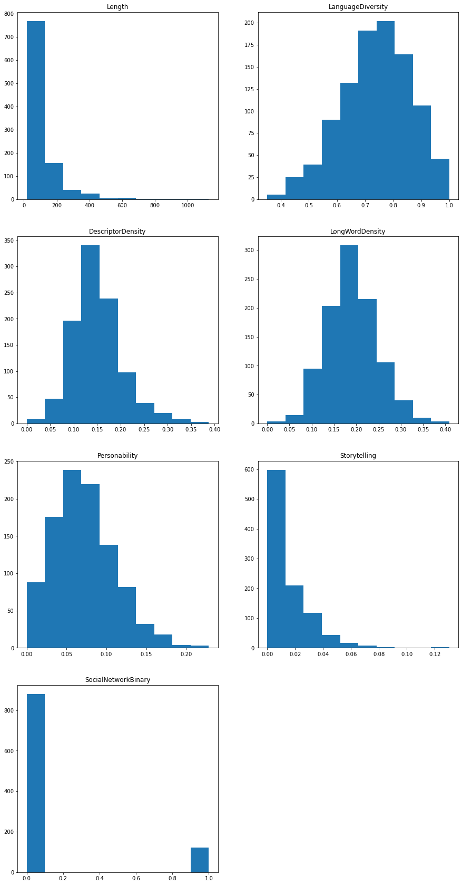

<h1 align='center'>Product Reviews: Text Attributes</h1>

<h2>Contents</h2>
<ol>
    <li><a href='#results'>Summary of Results</a></li>
    <li><a href='#source'>Data Source and Discussion</a></li>
    <li><a href='#length'>Length</a></li>
    <li><a href='#diver'>Language Diversity</a></li>
    <li><a href='#desc'>Descriptor Density</a></li>
    <li><a href='#freqDesc'>Most Frequent Descriptors</a></li>
    <li><a href='#longword'>Long-Word Density</a></li>
    <li><a href='#pers'>Personability</a></li>
    <li><a href='#story'>Storytelling</a></li>
    <li><a href='#social'>Social Network Markers</a></li>
    <li><a href='#summarize'>Summarize Data</a></li>
    <li><a href='#future'>Future Work</a></li>
</ol>

<a id='results'></a><h2>Summary of Results</h2>

This project is a step towards assessing whether or not a review was considered helpful based on the substance of the text review.  To this end, in this project we aim to better understand the structure of our collections of reviews, and do so by  augmenting the given dataset with eight variables to reveal text attributes.  Specifically, we establish the following:

<ul>
    <li><b>Length</b>: A simple measure of the length of each text</li>
    <li><b>LanguageDiversity</b>: how rich is the language used  </li>
    <li><b>DescriptorDensity</b>: the frequency with which adjectives and adverbs are used to modify or amplify meaning  </li>
    <li><b>MostFrequentDescriptors</b>: a list of the words in the DescriptorDensity that are used with notable frequency  </li>
    <li><b>LongWordDensity</b>: a method of insight into the general accessibility of a text </li>
    <li><b>Personability</b>: the amount of pronouns and possessives used in order to share personal experience </li>
    <li><b>Storytelling</b>: the level to which a text provides a narrative structure </li>
    <li><b>SocialNetworkBinary</b>: a binary measure of the extent to which a text leverages small group consensus </li>
</ul>
Additional, but brief, discussion for motivation is given in the respective subsections below.

The general structure of these is glimpsed through their respective distributions:


```python
columns_for_hist = ['Length','LanguageDiversity','DescriptorDensity','LongWordDensity','Personability','Storytelling','SocialNetworkBinary']

fig = plt.figure(figsize=[15, 30])

for col in columns_for_hist:
    #setup position on canvas
    i = columns_for_hist.index(col)
    ax = fig.add_subplot(4,2,i+1)
    
    #the actual plot
    ax.hist(reviews_sample[col])
    ax.set_title(col)
    ax.xaxis.set_ticks_position('bottom')

plt.subplots_adjust(hspace = 0.2)
plt.show()
```


    

    


Notably, the above results indicate that, with the possible exceptions of Length, Storytelling, and SocialNetworkBinary, there is enough variation within the dataset that we should proceed with inspecting their impact on the helpfulness score of each review.

Note: we don't expect any single attribute to have much independent value and future modelling will need to account for their interaction, i.e., we expect substantial instances of collinearity.  For example, short reviews like "This was great!" have a much higher probability of realizing greater language diversity scores.

<a id='source'></a><h2>Data Source and Discussion</h2>

The data are made available by <a href='https://www.kaggle.com/snap/amazon-fine-food-reviews' target='_blank'>The Stanford Network Analysis Project</a>. Included are 568,454 reviews from 256,059 users spanning 74,258 products.  The variables included for each observation are:


```python
reviews.columns
```


    Index(['Id', 'ProductId', 'UserId', 'ProfileName', 'HelpfulnessNumerator',
           'HelpfulnessDenominator', 'Score', 'Time', 'Summary', 'Text'],
          dtype='object')


Before beginning the actual work, we will arbitrarily choose two reviews to serve as working examples and walk through the reasoning of our desired attributes.  While we establish a good number of attributes, most are fairly intuitive and we keep the associated discussions as short as possible.  In the course of establishing these attributes, we will write the general functions we will need when we apply our reasoning to the entire dataset.  

Note: we will refer to an instance of a review as either "review" or "text", with no difference in meaning.


```python
#setup our standard environment and a dataframe of the dataset
import pandas as pd
import numpy as np
```


```python
reviews = pd.read_csv('Reviews.csv')
```


```python
#we will use the nltk package to perform our NLP
#punkt is the tokenizer
import nltk
nltk.download('punkt')
```

    [nltk_data] Downloading package punkt to
    [nltk_data]     C:\Users\Thomas\AppData\Roaming\nltk_data...
    [nltk_data]   Package punkt is already up-to-date!
    


    True


```python
#use python builtin to efficiently perform the requisite counting
from collections import Counter
```


```python
#arbitrarily choose our two worked examples and convert it into the two formats that the package requires
#note: we retain the raw text as its own variable.  this will make some methods easier to apply, e.g., inspecting html structure
raw1 = reviews['Text'][75165]
tokens1 = nltk.word_tokenize(raw1)
ex_text1 = nltk.Text(tokens1)

raw2 = reviews['Text'][275845]
tokens2 = nltk.word_tokenize(raw2)
ex_text2 = nltk.Text(tokens2)
```

Note: it is possible to remove all punctuation marks before applying the previous step.  There are arguments for keeping them and removing them, but we have chosen to leave the reviews as unchanged as possible.  We should be aware that, particularly with such short text instances, some of our measurements will be affected by this choice.  In particular heavy punctuation users will yield longer lengths and, hence, reduced density measurements.  Similarly for those users who include links or other html elements.  Removing them would negatively effect the tokenization process.  For instance, because we assume that the language contained in the reviews is more casual, we expect a high incidence of contractions, which would split into two tokens in the above process.  More thought and experimentation will be required on this topic in future work to find the optimal setup.

For reference, our working examples are:


```python
raw1
```


    "This was an Excellent value of buying on Amazon versus the pet stores.<br />It was packaged and labeled well for shipment.<br /><br />However - the manufacturer's plastic top of the box itself is a little cheap and less functional than I expected.  Frankly, the whole top has to come off each time I want to give my dog a single chew.<br /><br />So - I'm actually putting these chews into a Dog treat jar that has a open-and-close top with a tab.<br /><br />The manufacturer could simply change the bulk packaging to a bag.  Frankly, a Ziploc bag would be just as functional (and probably have a lower manufacturing cost) than the box."


```python
raw2
```


    'Product was fresh, and well wrapped.  All done with obvious care.'


<a id='length'></a><h2>Length</h2>

We start with the simplest metric, the length of the review.  For now, there is no need to write a general function for this.


```python
len(ex_text1)
```


    147


```python
len(ex_text2)
```


    14


Note: this is a measurement of the number of tokens, not a strict word count.

<a id='diver'></a><h2>Language Diversity</h2>

Normalizing by the length of the text, we will establish a simple measure of how diverse or rich the language used is.  Specifically, we will take the quotient of the number of unique words by the length of the text.


```python
def langDiversity(text):
    return len(set(text))/len(text)
```


```python
langDiversity(ex_text1)
```


    0.6122448979591837


```python
langDiversity(ex_text2)
```


    0.9285714285714286


<a id='desc'></a><h2>Descriptor Density</h2>

We look at the use of all adjectives and adverbs, and quotient by the length of the text to establish a density score.


```python
#parts-of-speech flagging requires the following to function
nltk.download('averaged_perceptron_tagger')
```

    [nltk_data] Downloading package averaged_perceptron_tagger to
    [nltk_data]     C:\Users\Thomas\AppData\Roaming\nltk_data...
    [nltk_data]   Package averaged_perceptron_tagger is already up-to-
    [nltk_data]       date!
    


    True


```python
def descrDens(text):
    #returns an arry of 2-tuples (word,POS)
    pos_tags = nltk.pos_tag(text)
    
    #flags corresponding to adjectives (JJ) and adverbs (RB), where the R and S "suffixes" indicate comparative and superlative versions, respectively
    pos = ["JJ", "JJR", "JJS", "RB", "RBR", "RBS" ]
    
    #we won't use the acutal words here, so just establish a count to increment
    count = 0
    
    #perform the actual counting
    for x in pos_tags:
        if x[1] in pos:
            count += 1
            
    return count/len(text)
```


```python
descrDens(ex_text1)
```


    0.11564625850340136


```python
descrDens(ex_text2)
```


    0.21428571428571427


<a id='freqDesc'></a><h2>Most Frequent Descriptors</h2>

To complement the previous metric, we will collect the 5 most frequently used adjectives and adverbs in each review.  But, to improve our tracking of trends within the text, we will only include descriptors that occur more than once.


```python
#this returns the desired results, but need to return and consider the efficiency
def freqDescr(text):
    #returns an arry of 2-tuples (word,POS)
    pos_tags = nltk.pos_tag(text)
    
    #flags corresponding to adjectives (JJ) and adverbs (RB), where the R and S "suffixes" indicate comparative and superlative versions, respectively
    pos = ["JJ", "JJR", "JJS", "RB", "RBR", "RBS" ]
    
    #implement the collecting
    descr = [x[0] for x in pos_tags if x[1] in pos]
    
    #remove words that occur once
    for key,value in Counter(descr).items():
        if value == 1:
            descr.remove(key)
            
    #limit our results to the top 5, will return an array of 2-tuples (word, count)
    return Counter(descr).most_common(5)
```


```python
freqDescr(ex_text1)
```


    [('functional', 2)]


```python
freqDescr(ex_text2)
```


    []


<a id='longword'></a><h2>Long-Word Density</h2>

We take 5 as the average length of a word in English (based on some searching, there seems to be a number of different results but they are all clustered around five).  And, we define a word as long if it is longer than this average.  We divide by the length of the text to establish the density score


```python
def longWord(token):
    long = [word for word in token if len(word)>5]
    return len(long)/len(token)
```


```python
longWord(tokens1)
```


    0.19727891156462585


```python
longWord(tokens2)
```


    0.21428571428571427


<a id='pers'></a><h2>Personability</h2>

As a measure of the personability or relatibility of the review, we will measure the pronoun and possessive usage, as a density.  This is based on the assumption that other users respond favorably to being able to project themselves into the experiences of others, and this process is made slightly easier through the use of personal pronouns.


```python
#the mechanics here are very much like the descriptor density function
def pronDens(text):
    #returns an arry of 2-tuples (word,POS)
    pos_tags = nltk.pos_tag(text)
    
    #flags corresponding to personal pronouns (PRP) and possessive version (PRP$)
    pos = ["PRP", "PRP$" ]
    
    #we won't use the acutal words here, so just establish a count to increment
    count = 0
    
    #perform the actual counting
    for x in pos_tags:
        #we don't want to include instances of "it"; while they are personal pronouns they are not personable enough for this application
        if 'it' not in x[0].lower():
            if x[1] in pos:
                count += 1
            
    return count/len(text)
```


```python
pronDens(ex_text1)
```


    0.027210884353741496


```python
pronDens(ex_text2)
```


    0.0


<a id='story'></a><h2>Storytelling</h2>

As another perspective on the reasoning underlying the previous metric, we assume that users are able to better identify with those reviews that have a stronger narrative structure.  In order to measure the level of storytelling, we will measure the density of the usage of words that denote the passage of time or a sequence of events.  The technical implementation here is quite simple (establish key words and check for inclusion), but the ease of this method does create some pitfalls.  Notably, such keyword lists are only as useful as they are exhaustive and some included words may have alternate meanings.


```python
#this is functional, but not very elegant and in linear time
def storyDens(tokens):
    #adjust our tokens to ignore cases
    tokens_uniform = [x.lower() for x in tokens]
    
    #establish our chosen identifies
    story_words = ['before','first','next','sometimes','earlier','begin','times','finally','previously','starting','consequently','time','conclusion','formerly','initially','following','occasionally','conclude','previous','originally','turn','periodically','end','past','onset','second','rarely','ultimately','prior','beginning','soon','seldomly','finish','preceding','then','yesterday','outset','henceforth','often','lastly','last','before','third','occasion','until','subsequently','now','advance','start','later','intermittently','after','afterwards','annual','anytime','belated','day','days','delay','delayed','early','evening','everyday','future','hour','late','later','midnight','midmorning','midafternoon','afternoon','minute','moment','momentarily','month','morning','night','nighttime','noon','present','schedule','season','someday','sometime','spring','summer','sunrise','sunset','today','tomorrow','tonight','week','winter','fall','autumn','year']
    
    #establish a count to increment
    count = 0
    
    #perform the actual counting
    for x in tokens_uniform:
        if x in story_words:
            count += 1
            
    return count/len(tokens)
```


```python
storyDens(ex_text1)
```


    0.006802721088435374


```python
storyDens(ex_text2)
```


    0.0


<a id='social'></a><h2>Social Network Markers</h2>

As yet another angle of attack on the relatability of a review, we will measure the use of words that connote familial or social connection, e.g., son, husband, kid, friend.  Because these words are less likely to appear multiple times and because of their assumed high collinearity with the pronoun density, we will establish this metric as a binary.


```python
#the initial setup is similar to storyDens. then exit conditions are simple
def socialBinary(tokens):
    #adjust our tokens to ignore cases
    tokens_uniform = [x.lower() for x in tokens]
    
    #establish our chosen identifies
    social_words = ['father','mother','dad','mom','son','daughter','brother','sister','husband','wife','parent','child','sibling','grandfather','grandmother','grandpa','grandma','grandson','granddaughter','grandparent','grandchild','grandchildren','uncle','aunt','cousin','nephew','niece','stepfather','stepdad','stepmother','stepmom','stepson','stepdaughter','stepsister','stepbrother','kid','kids','grandkids','friend','buddy','pal','acquaintance','classmate','partner','roommate','mate','acquaintance','neighbor','associate','colleague','assistant','boss','supervisor','employee','co-worker','teammate']
    
    #check inclusion, with an exit condition if realized
    for x in tokens_uniform:
        if x in social_words:
            return 1
            
    #this is only realized if the above loop campleted without finding any inclusion
    return 0
```


```python
socialBinary(tokens1)
```


    0


```python
socialBinary(tokens2)
```


    0


<a id='augment'></a><h2>Augmenting our Dataset</h2>

With functions now defined for our metrics, we will apply them to our dataset.  Before applying them to the full dataset, we will take a slice as a testing environment and ensure we do not have any errors in doing so.


```python
test_reviews = reviews.iloc[:20,:]
```

First, if we look at the functions we wrote above, we find that three of them utilize the tokens of the review and five utilize the NLTK text.  While it will cost more in storage, we will opt to establish the tokens and NLTK text as their own columns.  This has the advantage that we will be able to apply our functions in a vectorized fashion and reduce the computational time.

In order to do this, we will append the two columns to the dataframe, then define functions that will establish the tokens and NLTK text given a row from our dataframe, then use the apply method to populate our columns.


```python
test_reviews = test_reviews.join(pd.DataFrame(
    {
        'Tokens': np.nan,
        'TextNLTK':  np.nan
    }, index=test_reviews.index
))
```


```python
def tokenize(row):
    raw = row['Text']
    tokens = nltk.word_tokenize(raw)
    return tokens
```


```python
def text_to_textNLTK(row):
    raw = row['Text']
    tokens = nltk.word_tokenize(raw)
    text =  nltk.Text(tokens)
    return text
```


```python
test_reviews['Tokens'] = test_reviews.apply(tokenize, axis=1)
```


```python
test_reviews['TextNLTK'] = test_reviews.apply(text_to_textNLTK, axis=1)
```


```python
test_reviews
```


<div>
<style scoped>
    .dataframe tbody tr th:only-of-type {
        vertical-align: middle;
    }

    .dataframe tbody tr th {
        vertical-align: top;
    }

    .dataframe thead th {
        text-align: right;
    }
</style>
<table border="1" class="dataframe">
  <thead>
    <tr style="text-align: right;">
      <th></th>
      <th>Id</th>
      <th>ProductId</th>
      <th>UserId</th>
      <th>ProfileName</th>
      <th>HelpfulnessNumerator</th>
      <th>HelpfulnessDenominator</th>
      <th>Score</th>
      <th>Time</th>
      <th>Summary</th>
      <th>Text</th>
      <th>Tokens</th>
      <th>TextNLTK</th>
    </tr>
  </thead>
  <tbody>
    <tr>
      <th>0</th>
      <td>1</td>
      <td>B001E4KFG0</td>
      <td>A3SGXH7AUHU8GW</td>
      <td>delmartian</td>
      <td>1</td>
      <td>1</td>
      <td>5</td>
      <td>1303862400</td>
      <td>Good Quality Dog Food</td>
      <td>I have bought several of the Vitality canned d...</td>
      <td>[I, have, bought, several, of, the, Vitality, ...</td>
      <td>(I, have, bought, several, of, the, Vitality, ...</td>
    </tr>
    <tr>
      <th>1</th>
      <td>2</td>
      <td>B00813GRG4</td>
      <td>A1D87F6ZCVE5NK</td>
      <td>dll pa</td>
      <td>0</td>
      <td>0</td>
      <td>1</td>
      <td>1346976000</td>
      <td>Not as Advertised</td>
      <td>Product arrived labeled as Jumbo Salted Peanut...</td>
      <td>[Product, arrived, labeled, as, Jumbo, Salted,...</td>
      <td>(Product, arrived, labeled, as, Jumbo, Salted,...</td>
    </tr>
    <tr>
      <th>2</th>
      <td>3</td>
      <td>B000LQOCH0</td>
      <td>ABXLMWJIXXAIN</td>
      <td>Natalia Corres "Natalia Corres"</td>
      <td>1</td>
      <td>1</td>
      <td>4</td>
      <td>1219017600</td>
      <td>"Delight" says it all</td>
      <td>This is a confection that has been around a fe...</td>
      <td>[This, is, a, confection, that, has, been, aro...</td>
      <td>(This, is, a, confection, that, has, been, aro...</td>
    </tr>
    <tr>
      <th>3</th>
      <td>4</td>
      <td>B000UA0QIQ</td>
      <td>A395BORC6FGVXV</td>
      <td>Karl</td>
      <td>3</td>
      <td>3</td>
      <td>2</td>
      <td>1307923200</td>
      <td>Cough Medicine</td>
      <td>If you are looking for the secret ingredient i...</td>
      <td>[If, you, are, looking, for, the, secret, ingr...</td>
      <td>(If, you, are, looking, for, the, secret, ingr...</td>
    </tr>
    <tr>
      <th>4</th>
      <td>5</td>
      <td>B006K2ZZ7K</td>
      <td>A1UQRSCLF8GW1T</td>
      <td>Michael D. Bigham "M. Wassir"</td>
      <td>0</td>
      <td>0</td>
      <td>5</td>
      <td>1350777600</td>
      <td>Great taffy</td>
      <td>Great taffy at a great price.  There was a wid...</td>
      <td>[Great, taffy, at, a, great, price, ., There, ...</td>
      <td>(Great, taffy, at, a, great, price, ., There, ...</td>
    </tr>
    <tr>
      <th>5</th>
      <td>6</td>
      <td>B006K2ZZ7K</td>
      <td>ADT0SRK1MGOEU</td>
      <td>Twoapennything</td>
      <td>0</td>
      <td>0</td>
      <td>4</td>
      <td>1342051200</td>
      <td>Nice Taffy</td>
      <td>I got a wild hair for taffy and ordered this f...</td>
      <td>[I, got, a, wild, hair, for, taffy, and, order...</td>
      <td>(I, got, a, wild, hair, for, taffy, and, order...</td>
    </tr>
    <tr>
      <th>6</th>
      <td>7</td>
      <td>B006K2ZZ7K</td>
      <td>A1SP2KVKFXXRU1</td>
      <td>David C. Sullivan</td>
      <td>0</td>
      <td>0</td>
      <td>5</td>
      <td>1340150400</td>
      <td>Great!  Just as good as the expensive brands!</td>
      <td>This saltwater taffy had great flavors and was...</td>
      <td>[This, saltwater, taffy, had, great, flavors, ...</td>
      <td>(This, saltwater, taffy, had, great, flavors, ...</td>
    </tr>
    <tr>
      <th>7</th>
      <td>8</td>
      <td>B006K2ZZ7K</td>
      <td>A3JRGQVEQN31IQ</td>
      <td>Pamela G. Williams</td>
      <td>0</td>
      <td>0</td>
      <td>5</td>
      <td>1336003200</td>
      <td>Wonderful, tasty taffy</td>
      <td>This taffy is so good.  It is very soft and ch...</td>
      <td>[This, taffy, is, so, good, ., It, is, very, s...</td>
      <td>(This, taffy, is, so, good, ., It, is, very, s...</td>
    </tr>
    <tr>
      <th>8</th>
      <td>9</td>
      <td>B000E7L2R4</td>
      <td>A1MZYO9TZK0BBI</td>
      <td>R. James</td>
      <td>1</td>
      <td>1</td>
      <td>5</td>
      <td>1322006400</td>
      <td>Yay Barley</td>
      <td>Right now I'm mostly just sprouting this so my...</td>
      <td>[Right, now, I, 'm, mostly, just, sprouting, t...</td>
      <td>(Right, now, I, 'm, mostly, just, sprouting, t...</td>
    </tr>
    <tr>
      <th>9</th>
      <td>10</td>
      <td>B00171APVA</td>
      <td>A21BT40VZCCYT4</td>
      <td>Carol A. Reed</td>
      <td>0</td>
      <td>0</td>
      <td>5</td>
      <td>1351209600</td>
      <td>Healthy Dog Food</td>
      <td>This is a very healthy dog food. Good for thei...</td>
      <td>[This, is, a, very, healthy, dog, food, ., Goo...</td>
      <td>(This, is, a, very, healthy, dog, food, ., Goo...</td>
    </tr>
    <tr>
      <th>10</th>
      <td>11</td>
      <td>B0001PB9FE</td>
      <td>A3HDKO7OW0QNK4</td>
      <td>Canadian Fan</td>
      <td>1</td>
      <td>1</td>
      <td>5</td>
      <td>1107820800</td>
      <td>The Best Hot Sauce in the World</td>
      <td>I don't know if it's the cactus or the tequila...</td>
      <td>[I, do, n't, know, if, it, 's, the, cactus, or...</td>
      <td>(I, do, n't, know, if, it, 's, the, cactus, or...</td>
    </tr>
    <tr>
      <th>11</th>
      <td>12</td>
      <td>B0009XLVG0</td>
      <td>A2725IB4YY9JEB</td>
      <td>A Poeng "SparkyGoHome"</td>
      <td>4</td>
      <td>4</td>
      <td>5</td>
      <td>1282867200</td>
      <td>My cats LOVE this "diet" food better than thei...</td>
      <td>One of my boys needed to lose some weight and ...</td>
      <td>[One, of, my, boys, needed, to, lose, some, we...</td>
      <td>(One, of, my, boys, needed, to, lose, some, we...</td>
    </tr>
    <tr>
      <th>12</th>
      <td>13</td>
      <td>B0009XLVG0</td>
      <td>A327PCT23YH90</td>
      <td>LT</td>
      <td>1</td>
      <td>1</td>
      <td>1</td>
      <td>1339545600</td>
      <td>My Cats Are Not Fans of the New Food</td>
      <td>My cats have been happily eating Felidae Plati...</td>
      <td>[My, cats, have, been, happily, eating, Felida...</td>
      <td>(My, cats, have, been, happily, eating, Felida...</td>
    </tr>
    <tr>
      <th>13</th>
      <td>14</td>
      <td>B001GVISJM</td>
      <td>A18ECVX2RJ7HUE</td>
      <td>willie "roadie"</td>
      <td>2</td>
      <td>2</td>
      <td>4</td>
      <td>1288915200</td>
      <td>fresh and greasy!</td>
      <td>good flavor! these came securely packed... the...</td>
      <td>[good, flavor, !, these, came, securely, packe...</td>
      <td>(good, flavor, !, these, came, securely, packe...</td>
    </tr>
    <tr>
      <th>14</th>
      <td>15</td>
      <td>B001GVISJM</td>
      <td>A2MUGFV2TDQ47K</td>
      <td>Lynrie "Oh HELL no"</td>
      <td>4</td>
      <td>5</td>
      <td>5</td>
      <td>1268352000</td>
      <td>Strawberry Twizzlers - Yummy</td>
      <td>The Strawberry Twizzlers are my guilty pleasur...</td>
      <td>[The, Strawberry, Twizzlers, are, my, guilty, ...</td>
      <td>(The, Strawberry, Twizzlers, are, my, guilty, ...</td>
    </tr>
    <tr>
      <th>15</th>
      <td>16</td>
      <td>B001GVISJM</td>
      <td>A1CZX3CP8IKQIJ</td>
      <td>Brian A. Lee</td>
      <td>4</td>
      <td>5</td>
      <td>5</td>
      <td>1262044800</td>
      <td>Lots of twizzlers, just what you expect.</td>
      <td>My daughter loves twizzlers and this shipment ...</td>
      <td>[My, daughter, loves, twizzlers, and, this, sh...</td>
      <td>(My, daughter, loves, twizzlers, and, this, sh...</td>
    </tr>
    <tr>
      <th>16</th>
      <td>17</td>
      <td>B001GVISJM</td>
      <td>A3KLWF6WQ5BNYO</td>
      <td>Erica Neathery</td>
      <td>0</td>
      <td>0</td>
      <td>2</td>
      <td>1348099200</td>
      <td>poor taste</td>
      <td>I love eating them and they are good for watch...</td>
      <td>[I, love, eating, them, and, they, are, good, ...</td>
      <td>(I, love, eating, them, and, they, are, good, ...</td>
    </tr>
    <tr>
      <th>17</th>
      <td>18</td>
      <td>B001GVISJM</td>
      <td>AFKW14U97Z6QO</td>
      <td>Becca</td>
      <td>0</td>
      <td>0</td>
      <td>5</td>
      <td>1345075200</td>
      <td>Love it!</td>
      <td>I am very satisfied with my Twizzler purchase....</td>
      <td>[I, am, very, satisfied, with, my, Twizzler, p...</td>
      <td>(I, am, very, satisfied, with, my, Twizzler, p...</td>
    </tr>
    <tr>
      <th>18</th>
      <td>19</td>
      <td>B001GVISJM</td>
      <td>A2A9X58G2GTBLP</td>
      <td>Wolfee1</td>
      <td>0</td>
      <td>0</td>
      <td>5</td>
      <td>1324598400</td>
      <td>GREAT SWEET CANDY!</td>
      <td>Twizzlers, Strawberry my childhood favorite ca...</td>
      <td>[Twizzlers, ,, Strawberry, my, childhood, favo...</td>
      <td>(Twizzlers, ,, Strawberry, my, childhood, favo...</td>
    </tr>
    <tr>
      <th>19</th>
      <td>20</td>
      <td>B001GVISJM</td>
      <td>A3IV7CL2C13K2U</td>
      <td>Greg</td>
      <td>0</td>
      <td>0</td>
      <td>5</td>
      <td>1318032000</td>
      <td>Home delivered twizlers</td>
      <td>Candy was delivered very fast and was purchase...</td>
      <td>[Candy, was, delivered, very, fast, and, was, ...</td>
      <td>(Candy, was, delivered, very, fast, and, was, ...</td>
    </tr>
  </tbody>
</table>
</div>


To perform the vectorized operations, the apply method feeds a row into the given function.  As such, we will proceed as follows: (1) append our attribute columns with NaN values, (2) we will define adjusted versions of our attribute functions so that they may leverage our newly created Tokens and TextNLTK columns within the context of an entire row observation, (3) apply these new functions and populate our newly created columns


```python
test_reviews = test_reviews.join(pd.DataFrame(
    {
        'Length': np.nan,
        'LanguageDiversity':  np.nan,
        'DescriptorDensity':  np.nan,
        'MostFrequentDescriptors':  np.nan,
        'LongWordDensity':  np.nan,
        'Personability':  np.nan,
        'Storytelling':  np.nan,
        'SocialNetworkBinary':  np.nan
    }, index=test_reviews.index
))
```


```python
#we didn't define a function for length, but we will do so here given the row considerations
def rowLength(row):
    text = row['TextNLTK']
    return len(text)
```


```python
test_reviews['Length'] = test_reviews.apply(rowLength, axis=1)
```


```python
def rowLangDiversity(row):
    text = row['TextNLTK']
    return langDiversity(text)
```


```python
test_reviews['LanguageDiversity'] = test_reviews.apply(rowLangDiversity, axis=1)
```


```python
def rowDescrDens(row):
    text = row['TextNLTK']
    return descrDens(text)
```


```python
test_reviews['DescriptorDensity'] = test_reviews.apply(rowDescrDens, axis=1)
```


```python
def rowFreqDescr(row):
    text = row['TextNLTK']
    return freqDescr(text)
```


```python
test_reviews['MostFrequentDescriptors'] = test_reviews.apply(rowFreqDescr, axis=1)
```


```python
def rowLongWord(row):
    token = row['Tokens']
    return longWord(token)
```


```python
test_reviews['LongWordDensity'] = test_reviews.apply(rowLongWord, axis=1)
```


```python
def rowPronDens(row):
    text = row['TextNLTK']
    return pronDens(text)
```


```python
test_reviews['Personability'] = test_reviews.apply(rowPronDens, axis=1)
```


```python
def rowStoryDens(row):
    tokens = row['Tokens']
    return storyDens(tokens)
```


```python
test_reviews['Storytelling'] = test_reviews.apply(rowStoryDens, axis=1)
```


```python
def rowSocialBinary(row):
    tokens = row['Tokens']
    return socialBinary(tokens)
```


```python
test_reviews['SocialNetworkBinary'] = test_reviews.apply(rowSocialBinary, axis=1)
```

And our dataframe is now given by:


```python
test_reviews
```


<div>
<style scoped>
    .dataframe tbody tr th:only-of-type {
        vertical-align: middle;
    }

    .dataframe tbody tr th {
        vertical-align: top;
    }

    .dataframe thead th {
        text-align: right;
    }
</style>
<table border="1" class="dataframe">
  <thead>
    <tr style="text-align: right;">
      <th></th>
      <th>Id</th>
      <th>ProductId</th>
      <th>UserId</th>
      <th>ProfileName</th>
      <th>HelpfulnessNumerator</th>
      <th>HelpfulnessDenominator</th>
      <th>Score</th>
      <th>Time</th>
      <th>Summary</th>
      <th>Text</th>
      <th>Tokens</th>
      <th>TextNLTK</th>
      <th>Length</th>
      <th>LanguageDiversity</th>
      <th>DescriptorDensity</th>
      <th>MostFrequentDescriptors</th>
      <th>LongWordDensity</th>
      <th>Personability</th>
      <th>Storytelling</th>
      <th>SocialNetworkBinary</th>
    </tr>
  </thead>
  <tbody>
    <tr>
      <th>0</th>
      <td>1</td>
      <td>B001E4KFG0</td>
      <td>A3SGXH7AUHU8GW</td>
      <td>delmartian</td>
      <td>1</td>
      <td>1</td>
      <td>5</td>
      <td>1303862400</td>
      <td>Good Quality Dog Food</td>
      <td>I have bought several of the Vitality canned d...</td>
      <td>[I, have, bought, several, of, the, Vitality, ...</td>
      <td>(I, have, bought, several, of, the, Vitality, ...</td>
      <td>51</td>
      <td>0.803922</td>
      <td>0.156863</td>
      <td>[(better, 2)]</td>
      <td>0.294118</td>
      <td>0.078431</td>
      <td>0.000000</td>
      <td>0</td>
    </tr>
    <tr>
      <th>1</th>
      <td>2</td>
      <td>B00813GRG4</td>
      <td>A1D87F6ZCVE5NK</td>
      <td>dll pa</td>
      <td>0</td>
      <td>0</td>
      <td>1</td>
      <td>1346976000</td>
      <td>Not as Advertised</td>
      <td>Product arrived labeled as Jumbo Salted Peanut...</td>
      <td>[Product, arrived, labeled, as, Jumbo, Salted,...</td>
      <td>(Product, arrived, labeled, as, Jumbo, Salted,...</td>
      <td>37</td>
      <td>0.837838</td>
      <td>0.135135</td>
      <td>[]</td>
      <td>0.324324</td>
      <td>0.000000</td>
      <td>0.000000</td>
      <td>0</td>
    </tr>
    <tr>
      <th>2</th>
      <td>3</td>
      <td>B000LQOCH0</td>
      <td>ABXLMWJIXXAIN</td>
      <td>Natalia Corres "Natalia Corres"</td>
      <td>1</td>
      <td>1</td>
      <td>4</td>
      <td>1219017600</td>
      <td>"Delight" says it all</td>
      <td>This is a confection that has been around a fe...</td>
      <td>[This, is, a, confection, that, has, been, aro...</td>
      <td>(This, is, a, confection, that, has, been, aro...</td>
      <td>109</td>
      <td>0.660550</td>
      <td>0.146789</td>
      <td>[(tiny, 2)]</td>
      <td>0.211009</td>
      <td>0.027523</td>
      <td>0.009174</td>
      <td>1</td>
    </tr>
    <tr>
      <th>3</th>
      <td>4</td>
      <td>B000UA0QIQ</td>
      <td>A395BORC6FGVXV</td>
      <td>Karl</td>
      <td>3</td>
      <td>3</td>
      <td>2</td>
      <td>1307923200</td>
      <td>Cough Medicine</td>
      <td>If you are looking for the secret ingredient i...</td>
      <td>[If, you, are, looking, for, the, secret, ingr...</td>
      <td>(If, you, are, looking, for, the, secret, ingr...</td>
      <td>46</td>
      <td>0.847826</td>
      <td>0.108696</td>
      <td>[]</td>
      <td>0.239130</td>
      <td>0.108696</td>
      <td>0.000000</td>
      <td>0</td>
    </tr>
    <tr>
      <th>4</th>
      <td>5</td>
      <td>B006K2ZZ7K</td>
      <td>A1UQRSCLF8GW1T</td>
      <td>Michael D. Bigham "M. Wassir"</td>
      <td>0</td>
      <td>0</td>
      <td>5</td>
      <td>1350777600</td>
      <td>Great taffy</td>
      <td>Great taffy at a great price.  There was a wid...</td>
      <td>[Great, taffy, at, a, great, price, ., There, ...</td>
      <td>(Great, taffy, at, a, great, price, ., There, ...</td>
      <td>32</td>
      <td>0.718750</td>
      <td>0.125000</td>
      <td>[]</td>
      <td>0.062500</td>
      <td>0.031250</td>
      <td>0.000000</td>
      <td>0</td>
    </tr>
    <tr>
      <th>5</th>
      <td>6</td>
      <td>B006K2ZZ7K</td>
      <td>ADT0SRK1MGOEU</td>
      <td>Twoapennything</td>
      <td>0</td>
      <td>0</td>
      <td>4</td>
      <td>1342051200</td>
      <td>Nice Taffy</td>
      <td>I got a wild hair for taffy and ordered this f...</td>
      <td>[I, got, a, wild, hair, for, taffy, and, order...</td>
      <td>(I, got, a, wild, hair, for, taffy, and, order...</td>
      <td>88</td>
      <td>0.738636</td>
      <td>0.147727</td>
      <td>[(only, 2)]</td>
      <td>0.181818</td>
      <td>0.079545</td>
      <td>0.000000</td>
      <td>1</td>
    </tr>
    <tr>
      <th>6</th>
      <td>7</td>
      <td>B006K2ZZ7K</td>
      <td>A1SP2KVKFXXRU1</td>
      <td>David C. Sullivan</td>
      <td>0</td>
      <td>0</td>
      <td>5</td>
      <td>1340150400</td>
      <td>Great!  Just as good as the expensive brands!</td>
      <td>This saltwater taffy had great flavors and was...</td>
      <td>[This, saltwater, taffy, had, great, flavors, ...</td>
      <td>(This, saltwater, taffy, had, great, flavors, ...</td>
      <td>57</td>
      <td>0.824561</td>
      <td>0.175439</td>
      <td>[]</td>
      <td>0.263158</td>
      <td>0.017544</td>
      <td>0.000000</td>
      <td>0</td>
    </tr>
    <tr>
      <th>7</th>
      <td>8</td>
      <td>B006K2ZZ7K</td>
      <td>A3JRGQVEQN31IQ</td>
      <td>Pamela G. Williams</td>
      <td>0</td>
      <td>0</td>
      <td>5</td>
      <td>1336003200</td>
      <td>Wonderful, tasty taffy</td>
      <td>This taffy is so good.  It is very soft and ch...</td>
      <td>[This, taffy, is, so, good, ., It, is, very, s...</td>
      <td>(This, taffy, is, so, good, ., It, is, very, s...</td>
      <td>30</td>
      <td>0.833333</td>
      <td>0.233333</td>
      <td>[]</td>
      <td>0.200000</td>
      <td>0.066667</td>
      <td>0.000000</td>
      <td>0</td>
    </tr>
    <tr>
      <th>8</th>
      <td>9</td>
      <td>B000E7L2R4</td>
      <td>A1MZYO9TZK0BBI</td>
      <td>R. James</td>
      <td>1</td>
      <td>1</td>
      <td>5</td>
      <td>1322006400</td>
      <td>Yay Barley</td>
      <td>Right now I'm mostly just sprouting this so my...</td>
      <td>[Right, now, I, 'm, mostly, just, sprouting, t...</td>
      <td>(Right, now, I, 'm, mostly, just, sprouting, t...</td>
      <td>29</td>
      <td>0.896552</td>
      <td>0.172414</td>
      <td>[]</td>
      <td>0.172414</td>
      <td>0.137931</td>
      <td>0.034483</td>
      <td>0</td>
    </tr>
    <tr>
      <th>9</th>
      <td>10</td>
      <td>B00171APVA</td>
      <td>A21BT40VZCCYT4</td>
      <td>Carol A. Reed</td>
      <td>0</td>
      <td>0</td>
      <td>5</td>
      <td>1351209600</td>
      <td>Healthy Dog Food</td>
      <td>This is a very healthy dog food. Good for thei...</td>
      <td>[This, is, a, very, healthy, dog, food, ., Goo...</td>
      <td>(This, is, a, very, healthy, dog, food, ., Goo...</td>
      <td>29</td>
      <td>0.827586</td>
      <td>0.206897</td>
      <td>[]</td>
      <td>0.206897</td>
      <td>0.103448</td>
      <td>0.000000</td>
      <td>0</td>
    </tr>
    <tr>
      <th>10</th>
      <td>11</td>
      <td>B0001PB9FE</td>
      <td>A3HDKO7OW0QNK4</td>
      <td>Canadian Fan</td>
      <td>1</td>
      <td>1</td>
      <td>5</td>
      <td>1107820800</td>
      <td>The Best Hot Sauce in the World</td>
      <td>I don't know if it's the cactus or the tequila...</td>
      <td>[I, do, n't, know, if, it, 's, the, cactus, or...</td>
      <td>(I, do, n't, know, if, it, 's, the, cactus, or...</td>
      <td>184</td>
      <td>0.554348</td>
      <td>0.130435</td>
      <td>[(n't, 3), (hot, 3), (once, 2)]</td>
      <td>0.168478</td>
      <td>0.081522</td>
      <td>0.005435</td>
      <td>0</td>
    </tr>
    <tr>
      <th>11</th>
      <td>12</td>
      <td>B0009XLVG0</td>
      <td>A2725IB4YY9JEB</td>
      <td>A Poeng "SparkyGoHome"</td>
      <td>4</td>
      <td>4</td>
      <td>5</td>
      <td>1282867200</td>
      <td>My cats LOVE this "diet" food better than thei...</td>
      <td>One of my boys needed to lose some weight and ...</td>
      <td>[One, of, my, boys, needed, to, lose, some, we...</td>
      <td>(One, of, my, boys, needed, to, lose, some, we...</td>
      <td>72</td>
      <td>0.736111</td>
      <td>0.111111</td>
      <td>[(higher, 2)]</td>
      <td>0.152778</td>
      <td>0.069444</td>
      <td>0.013889</td>
      <td>0</td>
    </tr>
    <tr>
      <th>12</th>
      <td>13</td>
      <td>B0009XLVG0</td>
      <td>A327PCT23YH90</td>
      <td>LT</td>
      <td>1</td>
      <td>1</td>
      <td>1</td>
      <td>1339545600</td>
      <td>My Cats Are Not Fans of the New Food</td>
      <td>My cats have been happily eating Felidae Plati...</td>
      <td>[My, cats, have, been, happily, eating, Felida...</td>
      <td>(My, cats, have, been, happily, eating, Felida...</td>
      <td>86</td>
      <td>0.686047</td>
      <td>0.162791</td>
      <td>[(new, 3), (now, 2)]</td>
      <td>0.151163</td>
      <td>0.093023</td>
      <td>0.046512</td>
      <td>0</td>
    </tr>
    <tr>
      <th>13</th>
      <td>14</td>
      <td>B001GVISJM</td>
      <td>A18ECVX2RJ7HUE</td>
      <td>willie "roadie"</td>
      <td>2</td>
      <td>2</td>
      <td>4</td>
      <td>1288915200</td>
      <td>fresh and greasy!</td>
      <td>good flavor! these came securely packed... the...</td>
      <td>[good, flavor, !, these, came, securely, packe...</td>
      <td>(good, flavor, !, these, came, securely, packe...</td>
      <td>19</td>
      <td>0.842105</td>
      <td>0.263158</td>
      <td>[]</td>
      <td>0.263158</td>
      <td>0.052632</td>
      <td>0.000000</td>
      <td>0</td>
    </tr>
    <tr>
      <th>14</th>
      <td>15</td>
      <td>B001GVISJM</td>
      <td>A2MUGFV2TDQ47K</td>
      <td>Lynrie "Oh HELL no"</td>
      <td>4</td>
      <td>5</td>
      <td>5</td>
      <td>1268352000</td>
      <td>Strawberry Twizzlers - Yummy</td>
      <td>The Strawberry Twizzlers are my guilty pleasur...</td>
      <td>[The, Strawberry, Twizzlers, are, my, guilty, ...</td>
      <td>(The, Strawberry, Twizzlers, are, my, guilty, ...</td>
      <td>24</td>
      <td>0.916667</td>
      <td>0.083333</td>
      <td>[]</td>
      <td>0.250000</td>
      <td>0.125000</td>
      <td>0.000000</td>
      <td>1</td>
    </tr>
    <tr>
      <th>15</th>
      <td>16</td>
      <td>B001GVISJM</td>
      <td>A1CZX3CP8IKQIJ</td>
      <td>Brian A. Lee</td>
      <td>4</td>
      <td>5</td>
      <td>5</td>
      <td>1262044800</td>
      <td>Lots of twizzlers, just what you expect.</td>
      <td>My daughter loves twizzlers and this shipment ...</td>
      <td>[My, daughter, loves, twizzlers, and, this, sh...</td>
      <td>(My, daughter, loves, twizzlers, and, this, sh...</td>
      <td>29</td>
      <td>0.862069</td>
      <td>0.068966</td>
      <td>[]</td>
      <td>0.344828</td>
      <td>0.068966</td>
      <td>0.000000</td>
      <td>1</td>
    </tr>
    <tr>
      <th>16</th>
      <td>17</td>
      <td>B001GVISJM</td>
      <td>A3KLWF6WQ5BNYO</td>
      <td>Erica Neathery</td>
      <td>0</td>
      <td>0</td>
      <td>2</td>
      <td>1348099200</td>
      <td>poor taste</td>
      <td>I love eating them and they are good for watch...</td>
      <td>[I, love, eating, them, and, they, are, good, ...</td>
      <td>(I, love, eating, them, and, they, are, good, ...</td>
      <td>45</td>
      <td>0.777778</td>
      <td>0.111111</td>
      <td>[]</td>
      <td>0.155556</td>
      <td>0.200000</td>
      <td>0.022222</td>
      <td>0</td>
    </tr>
    <tr>
      <th>17</th>
      <td>18</td>
      <td>B001GVISJM</td>
      <td>AFKW14U97Z6QO</td>
      <td>Becca</td>
      <td>0</td>
      <td>0</td>
      <td>5</td>
      <td>1345075200</td>
      <td>Love it!</td>
      <td>I am very satisfied with my Twizzler purchase....</td>
      <td>[I, am, very, satisfied, with, my, Twizzler, p...</td>
      <td>(I, am, very, satisfied, with, my, Twizzler, p...</td>
      <td>28</td>
      <td>0.821429</td>
      <td>0.142857</td>
      <td>[]</td>
      <td>0.285714</td>
      <td>0.214286</td>
      <td>0.000000</td>
      <td>0</td>
    </tr>
    <tr>
      <th>18</th>
      <td>19</td>
      <td>B001GVISJM</td>
      <td>A2A9X58G2GTBLP</td>
      <td>Wolfee1</td>
      <td>0</td>
      <td>0</td>
      <td>5</td>
      <td>1324598400</td>
      <td>GREAT SWEET CANDY!</td>
      <td>Twizzlers, Strawberry my childhood favorite ca...</td>
      <td>[Twizzlers, ,, Strawberry, my, childhood, favo...</td>
      <td>(Twizzlers, ,, Strawberry, my, childhood, favo...</td>
      <td>157</td>
      <td>0.649682</td>
      <td>0.063694</td>
      <td>[]</td>
      <td>0.254777</td>
      <td>0.038217</td>
      <td>0.006369</td>
      <td>0</td>
    </tr>
    <tr>
      <th>19</th>
      <td>20</td>
      <td>B001GVISJM</td>
      <td>A3IV7CL2C13K2U</td>
      <td>Greg</td>
      <td>0</td>
      <td>0</td>
      <td>5</td>
      <td>1318032000</td>
      <td>Home delivered twizlers</td>
      <td>Candy was delivered very fast and was purchase...</td>
      <td>[Candy, was, delivered, very, fast, and, was, ...</td>
      <td>(Candy, was, delivered, very, fast, and, was, ...</td>
      <td>31</td>
      <td>0.774194</td>
      <td>0.129032</td>
      <td>[]</td>
      <td>0.161290</td>
      <td>0.064516</td>
      <td>0.000000</td>
      <td>0</td>
    </tr>
  </tbody>
</table>
</div>


With these working as we would like to in our test environment and acknowledging a hardware limitation on my end, we will follow the same steps for a sample drawn form our dataframe, without further discussion.  When done, we will export to a csv to allow for quick entry into future analysis.


```python
reviews = reviews.join(pd.DataFrame(
    {
        'Tokens': np.nan,
        'TextNLTK':  np.nan
    }, index=reviews.index
))
```


```python
#apply in chunks
reviews.iloc[550000:,10] = reviews.iloc[550000:,9:12].apply(tokenize, axis=1)
```


```python
#we will save a version of the dataframe with the populated tokens
reviews.to_csv('reviews_with_tokens.csv', index=False) 
```


```python
#establish our sample
#we will use just a routine sample size, and I will need to think further on the ideal sample size
reviews_sample = reviews.sample(n=1000, random_state=1)
```


```python
#populate the NLTK text objects
#note these need to be populated in an active session, hence we didn't populate them when we saved the tokens
reviews_sample['TextNLTK'] = reviews_sample.apply(text_to_textNLTK, axis=1)
```


```python
reviews_sample = reviews_sample.join(pd.DataFrame(
    {
        'Length': np.nan,
        'LanguageDiversity':  np.nan,
        'DescriptorDensity':  np.nan,
        'MostFrequentDescriptors':  np.nan,
        'LongWordDensity':  np.nan,
        'Personability':  np.nan,
        'Storytelling':  np.nan,
        'SocialNetworkBinary':  np.nan
    }, index=reviews_sample.index
))
```


```python
reviews_sample['Length'] = reviews_sample.apply(rowLength, axis=1)
```


```python
reviews_sample['LanguageDiversity'] = reviews_sample.apply(rowLangDiversity, axis=1)
```


```python
#sluggish based on my use of NLTK; need to optimize
reviews_sample['DescriptorDensity'] = reviews_sample.apply(rowDescrDens, axis=1)
```


```python
#need to optimize
reviews_sample['MostFrequentDescriptors'] = reviews_sample.apply(rowFreqDescr, axis=1)
```


```python
reviews_sample['LongWordDensity'] = reviews_sample.apply(rowLongWord, axis=1)
```


```python
#need to optimize
reviews_sample['Personability'] = reviews_sample.apply(rowPronDens, axis=1)
```


```python
reviews_sample['Storytelling'] = reviews_sample.apply(rowStoryDens, axis=1)
```


```python
reviews_sample['SocialNetworkBinary'] = reviews_sample.apply(rowSocialBinary, axis=1)
```


```python
#we will drop our NLTK related columns and the original text before saving our sample dataframe (on memory considerations)
del reviews_sample['Text']
del reviews_sample['Tokens']
del reviews_sample['TextNLTK']
```


```python
#save final augmented version of dataframe for quicker entry into analysis
reviews_sample.to_csv('reviews_sample_augmented.csv', index=False) 
```

And, our final result is given by:


```python
reviews_sample.head()
```


<div>
<style scoped>
    .dataframe tbody tr th:only-of-type {
        vertical-align: middle;
    }

    .dataframe tbody tr th {
        vertical-align: top;
    }

    .dataframe thead th {
        text-align: right;
    }
</style>
<table border="1" class="dataframe">
  <thead>
    <tr style="text-align: right;">
      <th></th>
      <th>Id</th>
      <th>ProductId</th>
      <th>UserId</th>
      <th>ProfileName</th>
      <th>HelpfulnessNumerator</th>
      <th>HelpfulnessDenominator</th>
      <th>Score</th>
      <th>Time</th>
      <th>Summary</th>
      <th>Length</th>
      <th>LanguageDiversity</th>
      <th>DescriptorDensity</th>
      <th>MostFrequentDescriptors</th>
      <th>LongWordDensity</th>
      <th>Personability</th>
      <th>Storytelling</th>
      <th>SocialNetworkBinary</th>
    </tr>
  </thead>
  <tbody>
    <tr>
      <th>288312</th>
      <td>288313</td>
      <td>B000ENUC3S</td>
      <td>AN66F3Q4QNU43</td>
      <td>Donna Speaker</td>
      <td>0</td>
      <td>0</td>
      <td>5</td>
      <td>1340496000</td>
      <td>Cherry Pie Larabar</td>
      <td>39</td>
      <td>0.717949</td>
      <td>0.102564</td>
      <td>[(low, 2)]</td>
      <td>0.076923</td>
      <td>0.076923</td>
      <td>0.000000</td>
      <td>0</td>
    </tr>
    <tr>
      <th>431726</th>
      <td>431727</td>
      <td>B002TMV3CG</td>
      <td>A3G007LQX6KGOD</td>
      <td>SevereWX</td>
      <td>0</td>
      <td>0</td>
      <td>5</td>
      <td>1287878400</td>
      <td>Melitta Coffee</td>
      <td>112</td>
      <td>0.687500</td>
      <td>0.151786</td>
      <td>[]</td>
      <td>0.294643</td>
      <td>0.071429</td>
      <td>0.008929</td>
      <td>0</td>
    </tr>
    <tr>
      <th>110311</th>
      <td>110312</td>
      <td>B004867T24</td>
      <td>A11LNY2OLQSUSV</td>
      <td>M. Castillo</td>
      <td>0</td>
      <td>0</td>
      <td>5</td>
      <td>1331769600</td>
      <td>great treat</td>
      <td>42</td>
      <td>0.880952</td>
      <td>0.166667</td>
      <td>[]</td>
      <td>0.119048</td>
      <td>0.095238</td>
      <td>0.000000</td>
      <td>0</td>
    </tr>
    <tr>
      <th>91855</th>
      <td>91856</td>
      <td>B004U7KPY0</td>
      <td>A1QCYVHWO5934U</td>
      <td>PistolaMia "PistolaMia"</td>
      <td>0</td>
      <td>0</td>
      <td>5</td>
      <td>1332806400</td>
      <td>Daily Calming</td>
      <td>25</td>
      <td>0.800000</td>
      <td>0.280000</td>
      <td>[]</td>
      <td>0.240000</td>
      <td>0.000000</td>
      <td>0.000000</td>
      <td>0</td>
    </tr>
    <tr>
      <th>338855</th>
      <td>338856</td>
      <td>B000FD78R0</td>
      <td>A30U2QQN2FFHE9</td>
      <td>J. Amicucci</td>
      <td>2</td>
      <td>3</td>
      <td>5</td>
      <td>1271376000</td>
      <td>Best Canned Artichokes Out There!</td>
      <td>279</td>
      <td>0.562724</td>
      <td>0.186380</td>
      <td>[(not, 5), (too, 3), (just, 2), (couple, 2), (...</td>
      <td>0.182796</td>
      <td>0.096774</td>
      <td>0.028674</td>
      <td>0</td>
    </tr>
  </tbody>
</table>
</div>


<a id='summarize'></a><h2>Summarize Data</h2>

Because this project has focused on expanding the dataset we were given with potentially useful attributes of the text review (rather than performing the full analysis of how these contribute to the helpfulness score, which we will be the focus of future work), we will end with a simple summary of our data through a view of the distributions of our new attributes.


```python
import matplotlib.pyplot as plt
```


```python
columns_for_hist = ['Length','LanguageDiversity','DescriptorDensity','LongWordDensity','Personability','Storytelling','SocialNetworkBinary']

fig = plt.figure(figsize=[15, 30])

for col in columns_for_hist:
    #setup position on canvas
    i = columns_for_hist.index(col)
    ax = fig.add_subplot(4,2,i+1)
    
    #the actual plot
    ax.hist(reviews_sample[col])
    ax.set_title(col)
    ax.xaxis.set_ticks_position('bottom')

plt.subplots_adjust(hspace = 0.2)
plt.show()
```


    

    


<a id='future'></a><h2>Future Work</h2>

I would also like to establish metrics for spelling error density (NLTK can't do this, but the Pattern module seems like a good option); how clean the structure of the review is (that is, I assume reviews that are closer to bullet-points are more often marked as helpful than walls of text), probably in the form of some weighted scoring; the occurence of abbreviations and "sms-speech", e.g., "u", "gr8"; and if an edit has occured.

I need to spend some more time optimizing this workflow.  NLTK doesn't scale very well in an application of numerous short texts, so I need to think through precisely where it's needed and the most efficient method to pipe it in.

Most of these attributes were either low-hanging fruit or aspects that I was curious about having any impact, and this project was intended to build some creative muscles.  Expanding this work with more established methodologies is certainly necessary, but will take more research.

I have ommitted sentiment analysis.  It would be simple enough to apply some density scoring for chosen word groups, but I prefer to delay this feature until I can perform a deeper dive.

The most glaring ommission must certainly be that we have not performed any regression to measure the utility of these attributes.  We will do so in a follow-up project.
